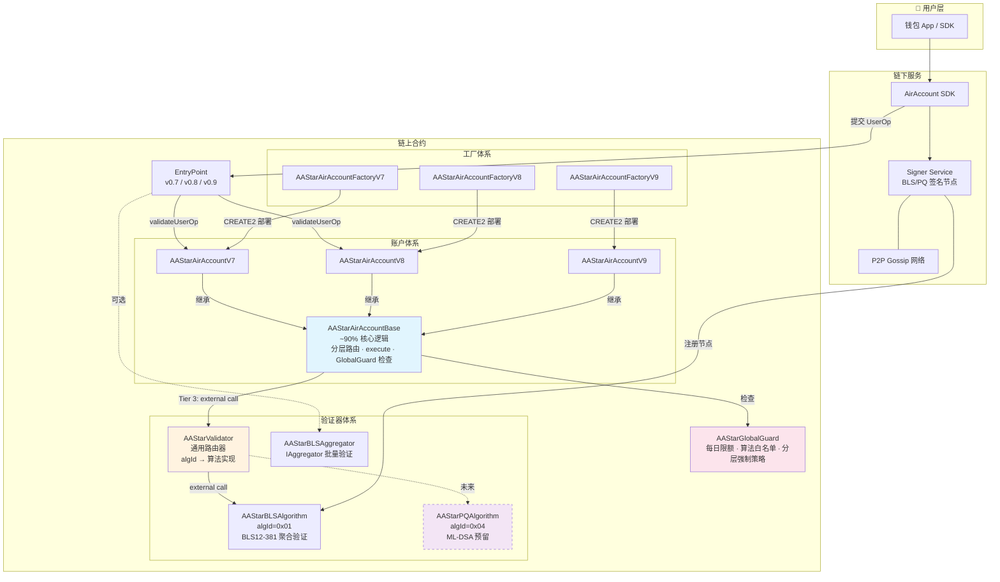
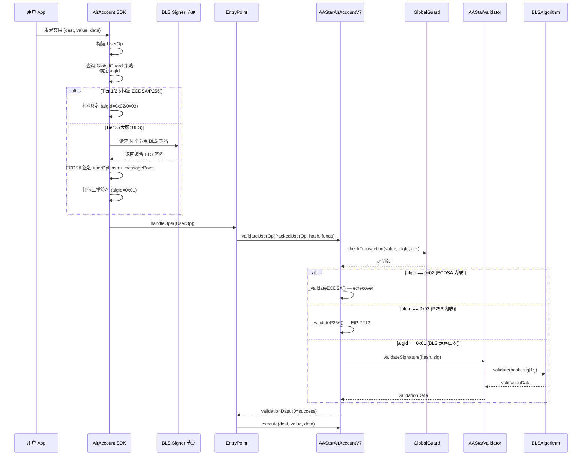
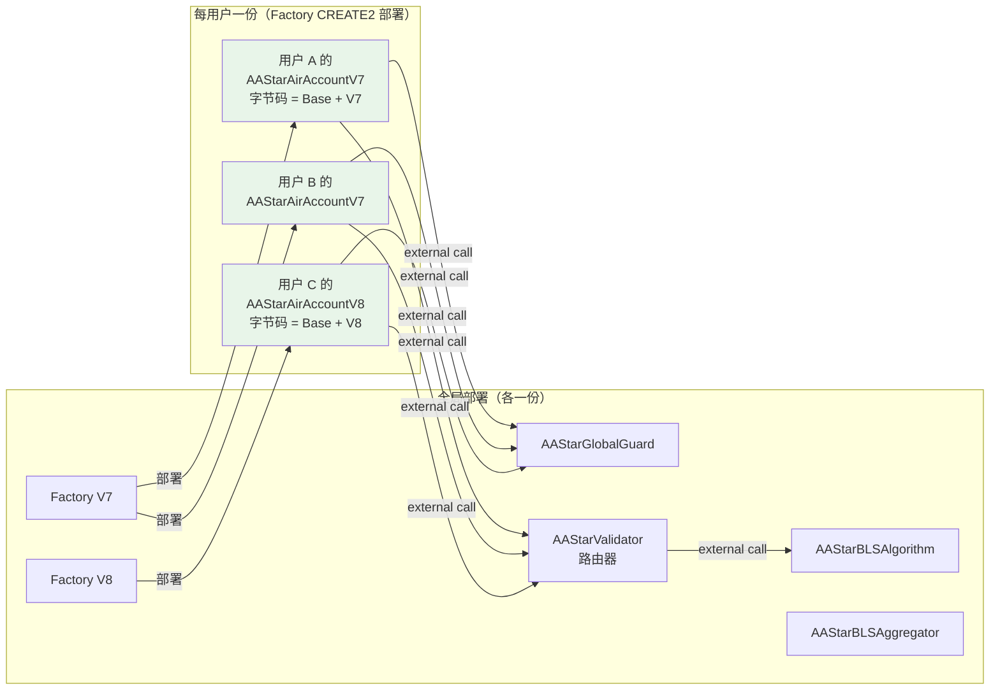
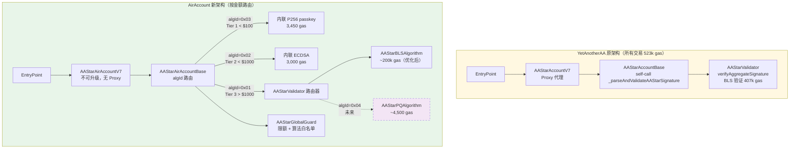

# AirAccount 统一账户与工厂体系设计

> 关联文档：[Validator 升级与 PQ 迁移分析](./validator-upgrade-pq-analysis.md) | [Gas 优化方案](./gas-optimization-plan.md)

## 总体架构图

### 全景视图：链上 + 链下完整体系



> **注**：ECDSA (algId=0x02) 和 P256 (algId=0x03) **内联**在 Base 中，不走路由器。虚线表示未来实现。

### 用户交易处理流程



### 合约部署与共享关系



> 用户账户字节码 = `AAStarAirAccountBase` + `V7/V8/V9 wrapper`。验证器、Guard、Factory 均通过 external call 调用，不编译进用户合约。

---

## 背景

YetAnotherAA 提供了完整的 BLS 验证 + 多版本 EntryPoint 账户体系（V6/V7/V8），但它是独立的合约体系。AirAccount 需要：

1. **保留 YetAnotherAA 的全部能力**（BLS 验证、三重签名、多 EntryPoint 版本）
2. **融入 AirAccount 自身的架构目标**（不可升级、分层验证、全局红线、隐私集成）
3. **统一账户和工厂**，避免每个子模块各自一套

### 命名规范

所有合约以 `AAStar` 开头（表明属于 AAStar 社区），`Air` 或 `BLS/P256/K1` 表明项目线/类型：

| 前缀 | 含义 | 示例 |
|------|------|------|
| `AAStar` | AAStar 社区统一前缀 | 所有合约 |
| `AirAccount` | AirAccount 项目的账户合约 | `AAStarAirAccountV7` |
| `BLS/P256/K1` | 验证器类型 | `AAStarBLSValidator` |

---

## 零、YetAnotherAA 9 个合约 → AirAccount 新合约完整对应表

### 合约角色说明

```
ERC-4337 合约体系的三个核心角色：

1. Account（账户实现）= 用户的智能钱包
   - 每个用户一个独立的合约实例
   - 验证签名、执行交易、管理 EntryPoint 存款

2. Factory（工厂）= 生产账户实例的"产线"
   - 用 CREATE2 确定性部署 Account 实例
   - 支持 counterfactual 地址预计算（先给钱再建号）
   - 全局只部署一个，所有用户共用

3. Validator（验证器）= 签名验证逻辑
   - 账户调用验证器来校验 UserOp 签名
   - 全局只部署一个，所有账户共用
```

### 完整对应表

| # | YetAnotherAA 原合约 | 角色 | AirAccount 新合约 | 变化说明 |
|---|---------------------|------|-------------------|---------|
| 1 | `AAStarValidator` | BLS 验证器 | **`AAStarValidator`**（路由器）+ **`AAStarBLSAlgorithm`** | 路由器根据 algId 分发；BLS 实现 assembly 重写；保持公钥管理 ABI 不变（NestJS 兼容） |
| 2 | `AAStarAccountBase` | 账户抽象基类 | **`AAStarAirAccountBase`** | 融入分层验证路由（Tier 1/2/3）+ GlobalGuard 红线检查；验证器完全解耦为 IValidator 插件 |
| 3 | `AAStarAccountV7` | V7 账户实现 | **`AAStarAirAccountV7`** | 继承 AAStarAirAccountBase；**不可升级**（去掉 ERC1967 Proxy） |
| 4 | `AAStarAccountV8` | V8 账户实现 | **`AAStarAirAccountV8`** | 同上 + `executeUserOp` |
| 5 | `AAStarAccountV6` | V6 账户实现 | **不替代（放弃 V6）** | V6 已过时，接口不同（UserOperation vs PackedUserOperation），UUPS 与不可升级冲突 |
| 6 | `AAStarAccountFactoryV7` | V7 工厂 | **`AAStarAirAccountFactoryV7`** | CREATE2 部署 AAStarAirAccountV7；支持创建时配置多验证器槽位 |
| 7 | `AAStarAccountFactoryV8` | V8 工厂 | **`AAStarAirAccountFactoryV8`** | 同上，部署 AAStarAirAccountV8 |
| 8 | `AAStarAccountFactoryV6` | V6 工厂 | **不替代（放弃 V6）** | 同 V6 账户 |
| 9 | — | — | **`AAStarBLSAggregator`** ⭐新增 | 实现 ERC-4337 IAggregator 接口，批量 BLS 验证（gas 优化核心） |
| 10 | — | — | **`AAStarGlobalGuard`** ⭐新增 | 硬编码每日限额红线护卫器 |
| 11 | — | — | **内联到 `AAStarAirAccountBase`** ⭐新增 | P256 WebAuthn passkey（Tier 1），内联省 75% 开销 |
| 12 | — | — | **内联到 `AAStarAirAccountBase`** ⭐新增 | ECDSA secp256k1（Tier 2），内联省 87% 开销 |
| 13 | — | — | **`AAStarAirAccountV9`** ⭐新增 | EntryPoint v0.9 适配（待 v0.9 IAccount 接口确认） |
| 14 | — | — | **`AAStarAirAccountFactoryV9`** ⭐新增 | V9 工厂 |

### 用户账户部署时编译了哪些代码？

```
最终部署的用户账户合约字节码包含：

  AAStarAirAccountBase（~90% 核心逻辑）
    ├─ 分层路由 · execute · executeBatch · GlobalGuard 检查
    ├─ 内联 ECDSA 验证（_validateECDSA，~10 行，省 87% external call 开销）
    ├─ 内联 P256 验证（_validateP256，~15 行，省 75% external call 开销）
    └─ Tier 3 → external call AAStarValidator 路由器
  + AAStarAirAccountV7（薄包装层，适配 EntryPoint v0.7 接口）
  = 用户账户合约字节码（由 Factory 通过 CREATE2 部署）

以下合约 **不** 编译进用户账户字节码：
  ✗ AAStarValidator       — 通用路由器，独立部署，全局共享
  ✗ AAStarBLSAlgorithm    — BLS 算法实现，独立部署，路由器调用
  ✗ AAStarGlobalGuard     — 策略控制器，独立部署，全局共享
  ✗ AAStarAirAccountFactory — 部署工具，用完即止
  ✗ AAStarBLSAggregator   — 独立部署，Bundler 调用
  ✗ AAStarPQAlgorithm     — 未来 PQ 实现，独立部署，路由器调用

好处：
  - Tier 1/2 内联验证 → 小额交易极低 gas（3,000-3,450）
  - Tier 3 外部调用 → 支持未来算法升级（PQ），用户零操作
  - 验证器升级不影响已部署的账户（只需路由器注册新算法）
  - 所有用户共享同一组全局合约 → 链上只需各部署一份
```

### 架构对比图（新旧对比）



### 链下服务策略（方案 B）

```
链上：全部替代
  AAStarValidator        → AAStarBLSValidator（保持 ABI 兼容）
  AAStarAccountV7/V8     → AAStarAirAccountV7/V8
  AAStarAccountFactoryV7 → AAStarAirAccountFactoryV7

链下：继续使用 YetAnotherAA NestJS 服务
  只改一个环境变量：VALIDATOR_CONTRACT_ADDRESS=<AAStarBLSValidator 新地址>
  NestJS 调用 registerPublicKey / isRegistered / getRegisteredNodes 等接口不变
  零代码改动
```

---

## 一、YetAnotherAA 三个版本的差异分析

### EntryPoint 版本接口差异

| 差异点 | V6 (EntryPoint v0.6) | V7 (EntryPoint v0.7) | V8 (EntryPoint v0.8) |
|--------|---------------------|---------------------|---------------------|
| UserOp 类型 | `UserOperation`（展开的 11 个字段） | `PackedUserOperation`（压缩格式） | `PackedUserOperation`（同 V7） |
| `validateUserOp` 参数 | `(UserOperation, bytes32, uint256)` | `(PackedUserOperation, bytes32, uint256)` | `(PackedUserOperation, bytes32, uint256)` |
| `executeUserOp` | 不存在 | 不存在 | **新增**：EntryPoint 直接调用执行 |
| nonce 验证 | 手动 `_validateNonce` | EntryPoint 内部处理 | EntryPoint 内部处理 |
| `_payPrefund` | 在 `validateUserOp` 中必须调用 | 有 `if (missingAccountFunds > 0)` 保护 | 同 V7 |
| 代理模式 | UUPSUpgradeable | ERC1967Proxy (外部部署) | ERC1967Proxy (外部部署) |
| 权限控制 | `_requireFromEntryPoint` | `_requireFromEntryPoint` + `_requireFromEntryPointOrCreator` | 同 V7 |
| IAccount 接口来源 | 自定义 interface | `account-abstraction/interfaces/IAccount.sol` | 同 V7 |

### 核心逻辑差异

```
V6 独有：
  - UUPSUpgradeable（可升级代理）
  - validateUserOp 内部调用 _validateNonce()
  - 工厂支持 batchCreateAccounts / createAAStarAccount 便捷方法
  - _validateSignature（V6 独立实现，不用 AAStarAccountBase）

V7/V8 共享：
  - 都继承 AAStarAccountBase（三重签名逻辑共用）
  - 都使用 PackedUserOperation
  - 工厂接口相同：createAccount(creator, signer, validator, useValidator, salt)

V8 独有：
  - executeUserOp(dest, value, func) — EntryPoint 可直接调用执行
```

### 本质结论

**V7 和 V8 的差异极小**（仅 `executeUserOp` 一个函数）。V6 差异较大（不同的 UserOp 类型 + UUPS 升级模式 + 独立验证逻辑）。

---

## 二、AirAccount 统一账户设计

### 设计原则

1. **不可升级**：不使用 UUPS/ERC1967 代理模式，直接部署逻辑合约
2. **版本化而非升级**：V1 → V2 通过工厂部署新合约 + 资产迁移
3. **验证器完全解耦**：所有签名验证逻辑在外部 Validator 插件中
4. **多 EntryPoint 兼容**：一套合约适配 v0.7 和 v0.8（v0.6 已过时，不支持）

### 为什么不支持 V6

| 原因 | 说明 |
|------|------|
| V6 已被社区淘汰 | 主流 bundler（Pimlico、Alchemy、Stackup）已停止 V6 支持 |
| UserOperation 结构不同 | V6 展开格式 vs V7/V8 PackedUserOperation，无法用同一接口兼容 |
| V6 自带 UUPS | 与 AirAccount 不可升级原则冲突 |
| 市场份额 | V7 是当前主流，V8 是未来方向 |

### 账户合约架构

```solidity
// src/core/AirAccount.sol
// 不可升级，直接部署的逻辑合约

contract AirAccount is IAccount {

    // ═══════════════════ IMMUTABLES ═══════════════════
    IEntryPoint public immutable entryPoint;     // V7 或 V8 的 EntryPoint
    address public immutable owner;              // 账户所有者 EOA
    address public immutable globalGuard;        // 红线护卫器地址
    uint256 public immutable dailyLimitUSD;      // 硬编码每日限额

    // ═══════════════════ STORAGE ═══════════════════
    // 验证器配置（创建时写入，之后不可更改）
    ValidatorSlot[3] public validators;          // Tier 1/2/3 各一个验证器槽位

    struct ValidatorSlot {
        address validator;      // IValidator 合约地址
        uint96 thresholdUSD;    // 触发阈值（美元）
    }

    // ═══════════════════ ENTRY POINTS ═══════════════════

    /// @dev V7/V8 通用：EntryPoint 调用验证
    function validateUserOp(
        PackedUserOperation calldata userOp,
        bytes32 userOpHash,
        uint256 missingAccountFunds
    ) external returns (uint256 validationData) {
        require(msg.sender == address(entryPoint), "only entrypoint");

        // 1. Global Guard：检查每日限额
        uint256 txValue = _extractTransactionValue(userOp.callData);
        globalGuard.checkDailyLimit(txValue);

        // 2. 分层路由：根据金额选择验证器
        address validator = _selectValidator(txValue);

        // 3. 调用验证器验证签名
        validationData = IValidator(validator).validateSignature(
            userOpHash,
            userOp.signature
        );

        // 4. 支付 prefund
        if (missingAccountFunds > 0) {
            _payPrefund(missingAccountFunds);
        }
    }

    /// @dev V8 专用：EntryPoint 直接调用执行
    function executeUserOp(
        address dest, uint256 value, bytes calldata func
    ) external {
        require(msg.sender == address(entryPoint), "only entrypoint");
        _call(dest, value, func);
    }

    /// @dev 通用执行（EntryPoint 或 owner 直接调用）
    function execute(address dest, uint256 value, bytes calldata func) external {
        require(
            msg.sender == address(entryPoint) || msg.sender == owner,
            "only entrypoint or owner"
        );
        _call(dest, value, func);
    }

    function executeBatch(
        address[] calldata dest,
        uint256[] calldata value,
        bytes[] calldata func
    ) external {
        require(
            msg.sender == address(entryPoint) || msg.sender == owner,
            "only entrypoint or owner"
        );
        for (uint256 i = 0; i < dest.length; i++) {
            _call(dest[i], value[i], func[i]);
        }
    }
}
```

### V7/V8 兼容策略

```
方案：同一份合约代码同时兼容 V7 和 V8

V7 EntryPoint 调用路径：
  EntryPoint.handleOps()
    → AirAccount.validateUserOp(PackedUserOp, hash, funds)  ✓ 有此方法
    → AirAccount.execute(dest, value, func)                  ✓ 通过 callData 解码

V8 EntryPoint 调用路径：
  EntryPoint.handleOps()
    → AirAccount.validateUserOp(PackedUserOp, hash, funds)  ✓ 同一方法
    → AirAccount.executeUserOp(dest, value, func)            ✓ V8 专用方法

关键：V7 不会调用 executeUserOp（因为 V7 EntryPoint 不知道这个方法），
      V8 可以选择调用 executeUserOp 或通过 callData 走 execute。
      两个方法都存在，互不干扰。
```

**因此不需要像 YetAnotherAA 那样维护 V7/V8 两套合约代码。**

---

## 三、统一工厂设计

### 当前问题

YetAnotherAA 为每个 EntryPoint 版本各维护一个工厂：
```
AAStarAccountFactoryV6  → 创建 AAStarAccountV6
AAStarAccountFactoryV7  → 创建 AAStarAccountV7
AAStarAccountFactoryV8  → 创建 AAStarAccountV8
```

### AirAccount 统一工厂

```solidity
// src/core/AirAccountFactory.sol

contract AirAccountFactory {
    // 一个工厂支持多个 EntryPoint 版本
    mapping(address => bool) public supportedEntryPoints;

    constructor(address[] memory entryPoints) {
        for (uint256 i = 0; i < entryPoints.length; i++) {
            supportedEntryPoints[entryPoints[i]] = true;
        }
    }

    /// @dev 创建 AirAccount 实例
    /// @param entryPoint V7 或 V8 的 EntryPoint 地址
    /// @param owner 账户所有者
    /// @param validators 三层验证器配置
    /// @param dailyLimitUSD 每日限额
    /// @param salt CREATE2 盐值
    function createAccount(
        address entryPoint,
        address owner,
        ValidatorConfig[3] calldata validators,
        uint256 dailyLimitUSD,
        uint256 salt
    ) external returns (address account) {
        require(supportedEntryPoints[entryPoint], "unsupported entrypoint");

        // CREATE2 确定性部署
        bytes32 actualSalt = keccak256(abi.encodePacked(
            owner, entryPoint, dailyLimitUSD, salt
        ));

        account = address(new AirAccount{salt: actualSalt}(
            IEntryPoint(entryPoint),
            owner,
            validators,
            dailyLimitUSD
        ));
    }

    /// @dev 预计算账户地址（counterfactual）
    function getAddress(
        address entryPoint,
        address owner,
        ValidatorConfig[3] calldata validators,
        uint256 dailyLimitUSD,
        uint256 salt
    ) external view returns (address) {
        bytes32 actualSalt = keccak256(abi.encodePacked(
            owner, entryPoint, dailyLimitUSD, salt
        ));
        return Create2.computeAddress(
            actualSalt,
            keccak256(abi.encodePacked(
                type(AirAccount).creationCode,
                abi.encode(entryPoint, owner, validators, dailyLimitUSD)
            ))
        );
    }
}
```

### ValidatorConfig 结构

```solidity
struct ValidatorConfig {
    address validator;       // IValidator 合约地址
    uint96 thresholdUSD;     // 金额阈值
    bytes initData;          // 验证器初始化参数
}

// 示例创建调用：
factory.createAccount(
    ENTRYPOINT_V07,
    ownerAddress,
    [
        // Tier 1: < $100, WebAuthn passkey 单签
        ValidatorConfig(P256_VALIDATOR, 100, abi.encode(passkeyPubKey)),
        // Tier 2: $100-$1000, ECDSA 双因子
        ValidatorConfig(K1_VALIDATOR, 1000, abi.encode(secondDeviceAddr)),
        // Tier 3: > $1000, BLS 多节点聚合 + ECDSA
        ValidatorConfig(BLS_VALIDATOR, type(uint96).max, abi.encode(nodeIds))
    ],
    500,  // 每日限额 $500
    0     // salt
);
```

---

## 四、验证器插件体系

### IValidator 统一接口

```solidity
// src/interfaces/IValidator.sol

interface IValidator {
    /// @dev 验证签名，返回 ERC-4337 validationData
    /// @return 0 = success, 1 = failure, 或 packed(validAfter, validUntil, aggregator)
    function validateSignature(
        bytes32 userOpHash,
        bytes calldata signature
    ) external view returns (uint256 validationData);

    /// @dev 返回该验证器是否支持 IAggregator 批量验证
    function supportsAggregation() external pure returns (bool);

    /// @dev 如果支持聚合，返回 IAggregator 合约地址
    function aggregator() external view returns (address);
}
```

### 验证器实现矩阵

> 详细分析见 [Validator 升级与 PQ 迁移分析](./validator-upgrade-pq-analysis.md)

| 算法 | algId | 实现方式 | Gas（单笔） | 说明 |
|------|-------|---------|------------|------|
| ECDSA secp256k1 | 0x02 | **内联** Base | ~3,000 | Tier 1/2，`ecrecover` 预编译 |
| P-256 WebAuthn | 0x03 | **内联** Base | ~3,450 | Tier 1，EIP-7212 预编译 |
| BLS12-381 | 0x01 | **外部** `AAStarBLSAlgorithm` | ~130,000（优化后） | Tier 3，复杂+有状态 |
| ML-DSA (Dilithium) | 0x04 | **外部** 预留 | ~4,500（预编译后） | 等 EIP-8051 |
| FALCON | 0x05 | **外部** 预留 | ~1,200（预编译后） | 待提案 |

`AAStarValidator` 作为通用路由器，根据 `sig[0]` (algId) 分发到外部算法合约。
ECDSA/P256 因开销占比过高（75-87%）直接内联到 Base，不走路由器。

### AAStarBLSValidator：从 YetAnotherAA 提取的核心

```solidity
// src/validators/AAStarBLSValidator.sol
// 从 AAStarValidator.sol 提取核心逻辑，assembly 重写

contract AAStarBLSValidator is IValidator {
    // ═══════════ 从 AAStarValidator 保留的功能 ═══════════
    mapping(bytes32 => bytes) public registeredKeys;     // 节点公钥注册
    mapping(bytes32 => bool) public isRegistered;        // 节点注册状态
    bytes32[] public registeredNodes;                    // 节点列表
    address public owner;                                // 管理员

    // ═══════════ 新增：缓存聚合公钥 ═══════════
    mapping(bytes32 => bytes) public cachedAggKeys;      // setHash → aggregatedKey

    // ═══════════ 新增：IAggregator 支持 ═══════════
    address public immutable blsAggregator;              // 批量验证合约

    /// @dev 单笔验证（Tier 3 直接调用）
    function validateSignature(
        bytes32 userOpHash,
        bytes calldata signature
    ) external view override returns (uint256 validationData) {
        // 解析签名：[nodeIds...][blsSig][messagePoint][aaSig][mpSig]
        // 与 AAStarAccountBase._parseAndValidateAAStarSignature 相同的三重验证
        // 但用 assembly 重写所有内存操作
        ...
    }

    // ═══════════ 从 AAStarValidator 保留的管理功能 ═══════════
    function registerPublicKey(bytes32 nodeId, bytes calldata publicKey) external { ... }
    function updatePublicKey(bytes32 nodeId, bytes calldata newPublicKey) external onlyOwner { ... }
    function revokePublicKey(bytes32 nodeId) external onlyOwner { ... }
    function batchRegisterPublicKeys(bytes32[] calldata, bytes[] calldata) external onlyOwner { ... }

    // ═══════════ assembly 优化的内部函数 ═══════════

    /// @dev 用 mstore 替代逐字节拷贝（从 304k → ~30k gas）
    function _buildPairingDataAssembly(
        bytes memory aggKey,
        bytes calldata signature,
        bytes calldata messagePoint
    ) internal view returns (bool) {
        assembly {
            let pairingData := mload(0x40)
            // 768 bytes = 24 × mstore, 不需要循环
            // Copy generator point (128 bytes = 4 mstore)
            mstore(pairingData, GENERATOR_WORD_0)
            mstore(add(pairingData, 0x20), GENERATOR_WORD_1)
            mstore(add(pairingData, 0x40), GENERATOR_WORD_2)
            mstore(add(pairingData, 0x60), GENERATOR_WORD_3)
            // Copy signature (256 bytes = 8 mstore via calldatacopy)
            calldatacopy(add(pairingData, 0x80), signature.offset, 0x100)
            // Copy negated aggKey (128 bytes = 4 mstore)
            // ... mcopy or manual mstore
            // Copy messagePoint (256 bytes = 8 mstore via calldatacopy)
            calldatacopy(add(pairingData, 0x200), messagePoint.offset, 0x100)

            // Pairing precompile
            let success := staticcall(200000, 0x0F, pairingData, 768, pairingData, 32)
            // result check
        }
    }
}
```

---

## 五、YetAnotherAA 能力保留清单

| YetAnotherAA 原有能力 | AirAccount 中如何保留 | 位置 |
|----------------------|---------------------|------|
| BLS 聚合签名验证 | `AAStarBLSValidator.validateSignature()` | `src/validators/AAStarBLSValidator.sol` |
| 公钥注册/更新/撤销/批量 | `AAStarBLSValidator` 中保留全部管理函数 | 同上 |
| 节点列表查询 | `AAStarBLSValidator.getRegisteredNodes()` | 同上 |
| 三重签名（ECDSA×2 + BLS） | `AAStarBLSValidator.validateSignature()` 内部实现 | 同上 |
| Gas 估算 | `AAStarBLSValidator.getGasEstimate()` | 同上 |
| **多 EntryPoint 版本** | **统一 AirAccount 同时兼容 V7/V8** | `src/core/AirAccount.sol` |
| CREATE2 确定性部署 | `AirAccountFactory.createAccount()` | `src/core/AirAccountFactory.sol` |
| counterfactual 地址预计算 | `AirAccountFactory.getAddress()` | 同上 |
| 批量创建账户 | `AirAccountFactory.batchCreateAccounts()` | 同上 |
| AAStarValidator 可选启用 | 通过 Tier 3 ValidatorSlot 配置 | 工厂创建时指定 |
| EntryPoint deposit 管理 | `AirAccount.addDeposit() / getDeposit()` | `src/core/AirAccount.sol` |
| Owner 直接执行 | `AirAccount.execute()` 允许 owner 调用 | 同上 |
| NestJS BLS Signer Service | **保持独立运行**，不纳入合约 | `lib/YetAnotherAA-Validator/src/` |

---

## 六、多 EntryPoint 版本化发布策略

### 方案：每个 EntryPoint 大版本对应独立的 AirAccount 版本

```
AirAccount 版本化发布：

  EntryPoint v0.7（当前主流）
    └─ AirAccountV7.sol     ← 适配 V7 IAccount 接口
    └─ AirAccountFactoryV7.sol

  EntryPoint v0.8（下一代）
    └─ AirAccountV8.sol     ← 适配 V8 IAccount 接口（含 executeUserOp）
    └─ AirAccountFactoryV8.sol

  EntryPoint v0.9（已有接口，IAccount 与 v0.7 相同）
    └─ AAStarAirAccountV9.sol     ← 适配 v0.9 接口（待确认差异）
    └─ AAStarAirAccountFactoryV9.sol

共享部分（不因 EntryPoint 版本变化）：
  src/core/AirAccountBase.sol     ← 核心逻辑：分层路由、GlobalGuard、execute
  src/validators/AAStarBLSValidator.sol ← 验证器插件（与 EntryPoint 版本无关）
  src/validators/AAStarP256Validator.sol
  src/validators/AAStarK1Validator.sol
```

### 为什么版本化而非一套代码

| 维度 | 一套代码兼容 | 版本化发布 |
|------|------------|-----------|
| 代码清晰度 | 有死方法（V7 不用 `executeUserOp`） | **每个版本只有该版本需要的方法** |
| 合约大小 | 包含所有版本的方法，bytecode 更大 | **更小，部署 gas 更低** |
| 接口变更 | 需要向后兼容所有旧接口 | **直接按新接口写，无历史包袱** |
| 审计难度 | 需要考虑跨版本交互 | **每个版本独立审计** |
| 维护成本 | 一份代码但条件逻辑多 | 共享 Base 合约，版本差异极小 |

### 实现方式：继承 + 版本差异

```solidity
// src/core/AirAccountBase.sol — 所有版本共享的核心逻辑
abstract contract AirAccountBase {
    // 分层路由、GlobalGuard、execute、executeBatch
    // 验证器配置、owner 管理
    // 这些逻辑与 EntryPoint 版本无关

    function _validateSignatureWithTieredRouting(
        bytes32 userOpHash,
        bytes calldata signature,
        bytes calldata callData
    ) internal view returns (uint256 validationData) {
        uint256 txValue = _extractTransactionValue(callData);
        _checkGlobalGuard(txValue);
        address validator = _selectValidator(txValue);
        return IValidator(validator).validateSignature(userOpHash, signature);
    }

    function execute(address dest, uint256 value, bytes calldata func) external { ... }
    function executeBatch(...) external { ... }
}

// src/core/AirAccountV7.sol — V7 专用
contract AirAccountV7 is IAccount, AirAccountBase {
    IEntryPoint private immutable _entryPoint;

    function validateUserOp(
        PackedUserOperation calldata userOp,
        bytes32 userOpHash,
        uint256 missingAccountFunds
    ) external returns (uint256) {
        require(msg.sender == address(_entryPoint));
        uint256 result = _validateSignatureWithTieredRouting(
            userOpHash, userOp.signature, userOp.callData
        );
        if (missingAccountFunds > 0) _payPrefund(missingAccountFunds);
        return result;
    }
}

// src/core/AirAccountV8.sol — V8 专用
contract AirAccountV8 is IAccount, AirAccountBase {
    IEntryPoint private immutable _entryPoint;

    function validateUserOp(
        PackedUserOperation calldata userOp,
        bytes32 userOpHash,
        uint256 missingAccountFunds
    ) external returns (uint256) { ... }  // 同 V7

    // V8 新增
    function executeUserOp(
        address dest, uint256 value, bytes calldata func
    ) external {
        require(msg.sender == address(_entryPoint));
        _call(dest, value, func);
    }
}
```

### 版本迁移流程

当 EntryPoint v0.8 正式上线时：

```
1. 发布 AirAccountV8 + AirAccountFactoryV8
2. 用户在 UI 上点击 "迁移到 V8"
3. 后端生成 atomic batch UserOp:
   a. V7 账户: execute → 将所有资产转入 V8 账户
   b. V8 工厂: createAccount（同一个 owner，同一组 validators）
4. V7 账户余额清零，V8 账户继承相同配置
5. V7 账户合约仍然在链上，但不再使用
```

### 各版本发布优先级

| 版本 | 优先级 | 状态 | 说明 |
|------|--------|------|------|
| **AAStarAirAccountV7** | **最高** | 开发中 | V7 是当前主流 EntryPoint |
| AAStarAirAccountV8 | 中 | 等 V8 稳定 | V8 已发布但生态尚未全面迁移 |
| AAStarAirAccountV9 | 中 | 待评估 | v0.9 IAccount 接口与 v0.7 相同，差异待确认 |
| AirAccountV6 | **不做** | — | V6 已过时，与不可升级原则冲突（UUPS） |

---

## 七、对比总结

| 维度 | YetAnotherAA 当前方案 | AirAccount 统一方案 |
|------|---------------------|-------------------|
| **合约数量** | 9 个（3 版本 × 账户+工厂 + 1 Validator） | **4 个**（AirAccount + Factory + AAStarBLSValidator + GlobalGuard） |
| **代码重复** | V7/V8 代码 95% 相同但维护两份 | **零重复**，一套代码兼容 V7+V8 |
| **EntryPoint 兼容** | 每个版本独立合约 | **版本化发布**，共享 AirAccountBase |
| **验证器耦合** | BLS 验证逻辑嵌入账户合约 | **完全解耦**，可插拔 Validator 插件 |
| **升级模式** | V6 用 UUPS，V7/V8 用 ERC1967 Proxy | **不可升级**，版本迭代通过新部署+迁移 |
| **分层安全** | 无（全走 BLS 或 ECDSA） | **三层（Tier 1/2/3）**按金额路由 |
| **全局红线** | 无 | **硬编码每日限额** |
| **Gas（BLS 路径）** | 523,306 | **~200,000（优化后单笔）/ ~150,000（批量）** |
| **Gas（日常小额）** | 523,306（同样走 BLS） | **~30,000（P-256 passkey）** |
| **工厂** | 3 个工厂，每个绑定一个 EntryPoint | **每个版本 1 个工厂**，共享部署逻辑 |

---

## 八、项目文件结构规划

```
airaccount-contract/
├── src/                              ← AirAccount 自研合约
│   ├── core/
│   │   ├── AAStarAirAccountBase.sol          ← 共享核心逻辑（分层路由、GlobalGuard、execute）
│   │   ├── AAStarAirAccountV7.sol            ← EntryPoint v0.7 版本
│   │   ├── AAStarAirAccountV8.sol            ← EntryPoint v0.8 版本
│   │   ├── AAStarAirAccountV9.sol            ← EntryPoint v0.9 版本（待开发）
│   │   ├── AAStarAirAccountFactoryV7.sol     ← V7 工厂
│   │   ├── AAStarAirAccountFactoryV8.sol     ← V8 工厂
│   │   ├── AAStarAirAccountFactoryV9.sol     ← V9 工厂（待开发）
│   │   └── AAStarGlobalGuard.sol             ← 红线护卫器
│   ├── validators/
│   │   ├── IAAStarValidator.sol              ← 路由器接口
│   │   ├── IAAStarAlgorithm.sol             ← 算法实现接口
│   │   ├── AAStarValidator.sol              ← 通用路由器（algId → 算法实现）
│   │   └── AAStarBLSAlgorithm.sol           ← BLS12-381 实现（从 YetAnotherAA 提取+重写）
│   │   （ECDSA/P256 内联在 AAStarAirAccountBase 中，无独立合约）
│   ├── aggregator/
│   │   └── AAStarBLSAggregator.sol           ← IAggregator 批量验证
│   └── interfaces/
│       ├── IAAStarAirAccount.sol
│       └── IAAStarValidator.sol
├── test/                             ← Foundry 测试
│   ├── AAStarAirAccountV7.t.sol
│   ├── AAStarBLSValidator.t.sol
│   └── AAStarAirAccountFactoryV7.t.sol
├── script/                           ← 部署脚本
│   └── Deploy.s.sol
├── lib/                              ← 参考子模块（只读）
│   ├── account-abstraction/          ← eth-infinitism EntryPoint v0.7/v0.8/v0.9 接口
│   ├── YetAnotherAA-Validator/       ← BLS 参考实现
│   ├── light-account/                ← 轻量账户参考
│   ├── simple-team-account/          ← 团队账户参考
│   └── kernel/                       ← ERC-7579 参考
├── docs/
├── scripts/                          ← TS 测试脚本
└── foundry.toml
```

---

---

## 九、YetAnotherAA 完整能力审计与替代清单

YetAnotherAA 不只是链上合约，它包含 **链上 + 链下** 两大部分。完全替代需要覆盖所有能力。

### 能力全景图

```
YetAnotherAA 完整体系：

┌─ 链上合约（9 个）─────────────────────────────────────────────┐
│  AAStarValidator.sol         ← BLS 验证 + 节点公钥管理         │
│  AAStarAccountV6/V7/V8.sol   ← 三版本 ERC-4337 账户           │
│  AAStarAccountFactoryV6/V7/V8.sol ← 三版本工厂                │
│  AAStarAccountBase.sol       ← 三重签名 + 验证路由             │
└───────────────────────────────────────────────────────────────┘

┌─ 链下 NestJS 服务（6 个模块）────────────────────────────────┐
│  SignatureModule   ← BLS 签名 API（sign/aggregate/verify）    │
│  BlsModule         ← BLS 密码学核心（@noble/curves）          │
│  NodeModule        ← 节点身份管理（密钥对生成/持久化/注册）     │
│  BlockchainModule  ← 链上交互（注册/查询/撤销节点）            │
│  GossipModule      ← P2P 八卦协议（WebSocket/心跳/对等发现）   │
│  DashboardModule   ← Web 管理界面（节点/注册/状态）            │
└───────────────────────────────────────────────────────────────┘
```

### 逐项替代计划

#### A. 链上合约替代

| YetAnotherAA 组件 | AirAccount 替代 | 状态 | 说明 |
|-------------------|-----------------|------|------|
| `AAStarValidator.sol` | `src/validators/AAStarBLSValidator.sol` | 🔨 需开发 | 提取核心 BLS 验证逻辑，assembly 重写 |
| `AAStarAccountBase.sol` | `src/core/AirAccountBase.sol` | 🔨 需开发 | 三重签名逻辑融入分层验证路由 |
| `AAStarAccountV7.sol` | `src/core/AirAccountV7.sol` | 🔨 需开发 | 不可升级版本 |
| `AAStarAccountV8.sol` | `src/core/AirAccountV8.sol` | 🔨 需开发 | 含 executeUserOp |
| `AAStarAccountV6.sol` | **不替代** | ❌ 放弃 | V6 已过时 |
| `AAStarAccountFactoryV7.sol` | `src/core/AirAccountFactoryV7.sol` | 🔨 需开发 | 支持分层验证器配置 |
| `AAStarAccountFactoryV8.sol` | `src/core/AirAccountFactoryV8.sol` | 🔨 需开发 | 同上 |
| `AAStarAccountFactoryV6.sol` | **不替代** | ❌ 放弃 | 同 V6 |
| — | `src/aggregator/AAStarBLSAggregator.sol` | 🔨 新增 | IAggregator 批量验证（YetAnotherAA 没有） |
| — | `src/core/GlobalGuard.sol` | 🔨 新增 | 红线护卫器（YetAnotherAA 没有） |
| — | `src/validators/AAStarP256Validator.sol` | 🔨 新增 | WebAuthn passkey |
| — | `src/validators/AAStarK1Validator.sol` | 🔨 新增 | ECDSA |

#### B. 链下服务替代

| YetAnotherAA 模块 | 功能 | AirAccount 替代方案 | 优先级 |
|-------------------|------|-------------------|--------|
| **SignatureModule** | `POST /signature/sign` — 用本节点私钥签名 | `airaccount-signer` 服务 | **P0** |
| | `POST /signature/aggregate` — 聚合多个 BLS 签名 | 同上 | **P0** |
| | `POST /signature/verify` — 验证聚合签名 | 同上 | **P0** |
| **BlsModule** | BLS12-381 密码学（@noble/curves） | 直接复用 `@noble/curves` | **P0** |
| | `hashMessageToCurve` — 消息哈希到 G2 | 复用 | **P0** |
| | `encodeToEIP2537` — G1/G2 点编码 | 复用 bls.util.ts 逻辑 | **P0** |
| **NodeModule** | 节点密钥对生成 | `airaccount-signer` 内置 | **P0** |
| | 节点状态持久化（node_state.json） | 同上 | **P0** |
| | 链上注册触发 | 同上 | **P0** |
| **BlockchainModule** | `registerNodeOnChain` — 注册节点 | `airaccount-signer` 内置 | **P0** |
| | `checkNodeRegistration` — 查询注册状态 | 同上 | P1 |
| | `revokeNodeOnChain` — 撤销节点 | 同上 | P1 |
| | `batchRegisterNodesOnChain` — 批量注册 | 同上 | P2 |
| | `getRegisteredNodes` — 查询已注册节点 | 同上 | P1 |
| **GossipModule** | P2P 八卦协议（WebSocket） | `airaccount-signer` 内置 或独立服务 | **P1** |
| | 对等节点发现 + 心跳 | 同上 | P1 |
| | 消息传播（fan-out, TTL） | 同上 | P1 |
| | Bootstrap peers | 同上 | P1 |
| | 持久化已知节点 | 同上 | P2 |
| **DashboardModule** | Web 管理界面 | 后期开发（或用 CLI 替代） | **P2** |
| | 节点创建/删除 UI | CLI 工具 | P2 |
| | 链上注册状态查看 | CLI / cast 命令 | P2 |

#### C. 当前 E2E 测试脚本的依赖分析

`scripts/test-e2e-bls.ts` 当前直接使用 `@noble/curves` + `ethers`，**不依赖 YetAnotherAA 的 NestJS 服务**。但生产环境中：

```
生产环境签名流程：

用户钱包 App
  → 构建 UserOp
  → 计算 userOpHash
  → 计算 messagePoint = G2.hashToCurve(userOpHash)
  → 请求 N 个 BLS 节点签名：
      POST http://node1:3000/signature/sign {message: messagePoint}  ← 依赖 NestJS
      POST http://node2:3000/signature/sign {message: messagePoint}  ← 依赖 NestJS
  → 聚合签名：
      POST http://any-node:3000/signature/aggregate {signatures: [...]}  ← 依赖 NestJS
  → ECDSA 签名 userOpHash + messagePoint
  → 打包 738-byte signature
  → 提交 handleOps
```

**如果完全移除 YetAnotherAA，这些 API 端点就不存在了。** 必须有替代服务。

### 替代服务架构建议

```
方案 A：独立 airaccount-signer 服务（推荐）

  新建独立仓库：airaccount-signer
  技术栈：与 YetAnotherAA 相同（NestJS + @noble/curves + ethers）
  复用：从 YetAnotherAA 提取 BlsModule + SignatureModule + NodeModule + GossipModule
  改造：
    - 将合约交互指向 AAStarBLSValidator（而非 AAStarValidator）
    - 移除 V6 相关代码
    - 统一配置管理
    - 添加 API 认证

  优势：
    - 代码量小（~2000 行 TS）
    - 接口完全兼容，SDK 无缝迁移
    - 独立部署和扩展


方案 B：将 Signer 能力集成到 SDK（轻量化）

  不再运行独立的 NestJS 服务
  将 BLS 签名能力打包为 npm 包：@airaccount/bls-signer
  每个节点运行一个轻量 SDK 进程
  P2P 通过 libp2p 或简单 WebSocket 替代 Gossip 协议

  优势：
    - 无服务器运维
    - 更去中心化

  劣势：
    - 需要重写 P2P 层
    - 节点发现更复杂
```

### 迁移路线图（更新版）

```
Phase 0：准备（当前 ✅ 已完成）
  ✅ YetAnotherAA 部署到 Sepolia
  ✅ E2E BLS 测试通过
  ✅ 完整能力审计
  ✅ 添加 account-abstraction 子模块（含 v0.9 IAccount/IAggregator 接口）

Phase 1：链上合约开发（4 周）
  Week 1-2:
    - AirAccountBase.sol（分层路由 + GlobalGuard）
    - AAStarBLSValidator.sol（assembly 优化 BLS 验证）
    - AirAccountV7.sol
  Week 3:
    - AirAccountFactoryV7.sol
    - AAStarBLSAggregator.sol（IAggregator）
    - AAStarP256Validator.sol + AAStarK1Validator.sol
  Week 4:
    - 全套 Foundry 测试
    - Sepolia 部署 + E2E 验证
    - Gas 对比（目标：BLS 路径 < 200k，P-256 路径 < 50k）

Phase 2：链下服务替代（3 周）
  Week 5-6:
    - 新建 airaccount-signer 服务
    - 提取 BlsModule + SignatureModule + NodeModule
    - 将合约交互指向 AAStarBLSValidator
    - API 兼容测试
  Week 7:
    - GossipModule 迁移
    - 完整 E2E：App → Signer Service → AAStarBLSValidator → EntryPoint
    - SDK 更新指向新服务

Phase 3：V8/V9 + Optimism 部署（2 周）
  Week 8:
    - AirAccountV8.sol（加 executeUserOp）
    - AirAccountFactoryV8.sol
    - 确认 v0.9 IAccount 接口变化，评估是否需要 V9
  Week 9:
    - Optimism 主网部署
    - 生产环境验证

Phase 4：下线 YetAnotherAA 依赖（1 周）
  Week 10:
    - 将所有链上引用从 AAStarValidator 迁移到 AAStarBLSValidator
    - 关停 YetAnotherAA NestJS 服务
    - 移除 lib/YetAnotherAA-Validator 子模块（或标记为归档参考）
    - 完全独立运行验证
```

---

*2026-03-09*
