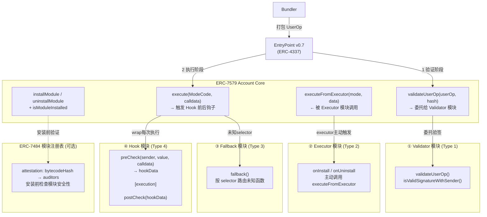
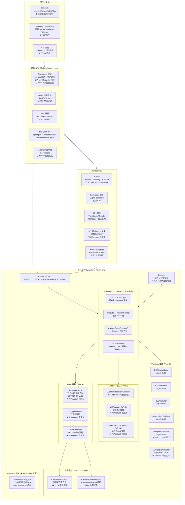
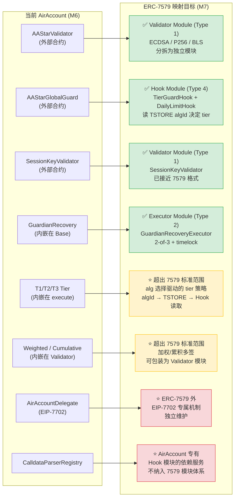
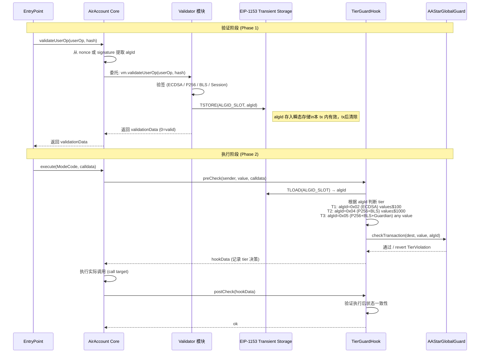
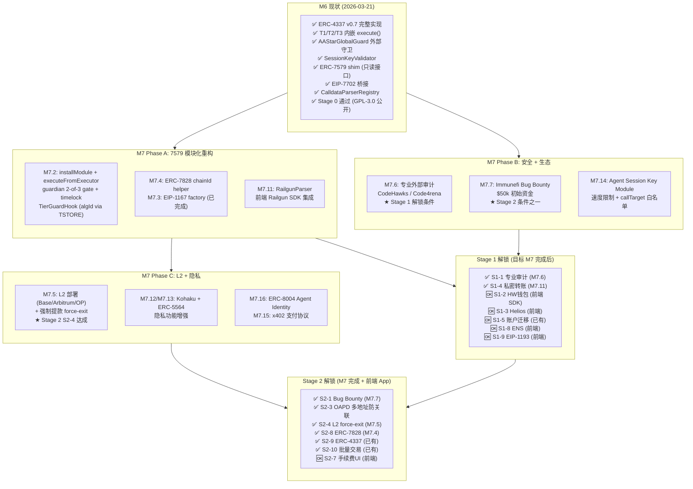
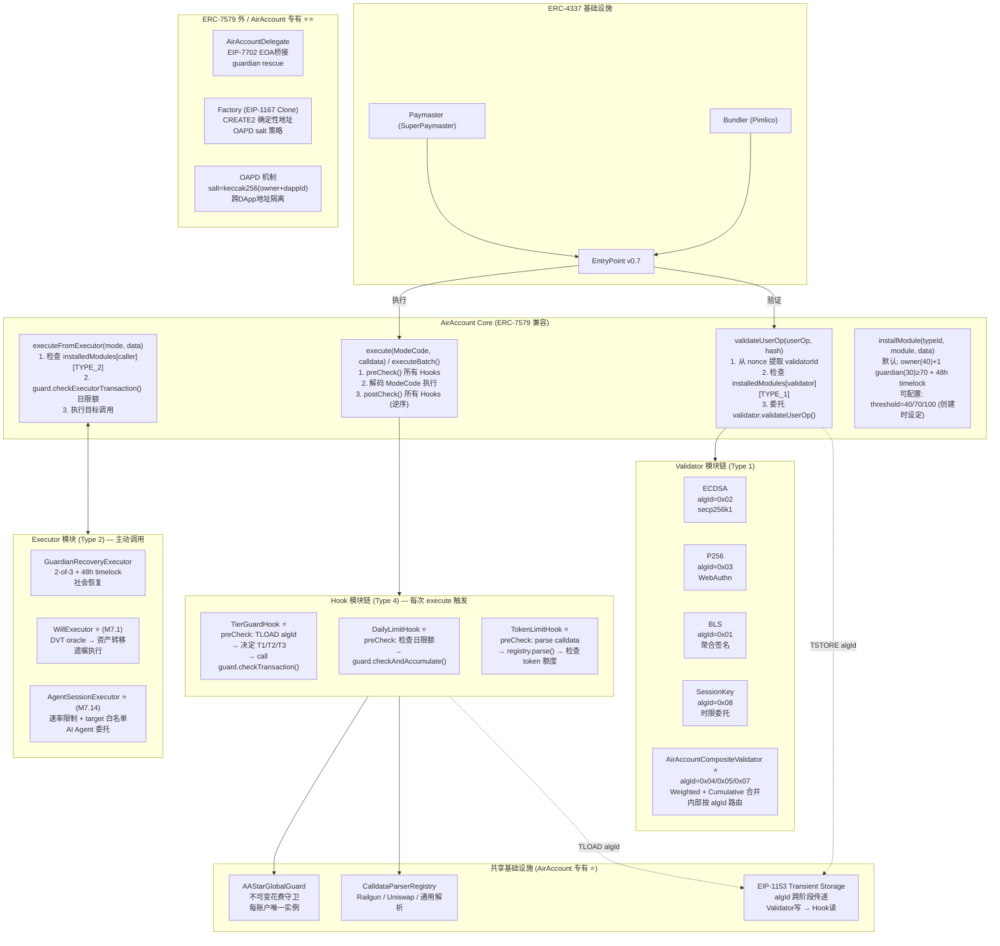
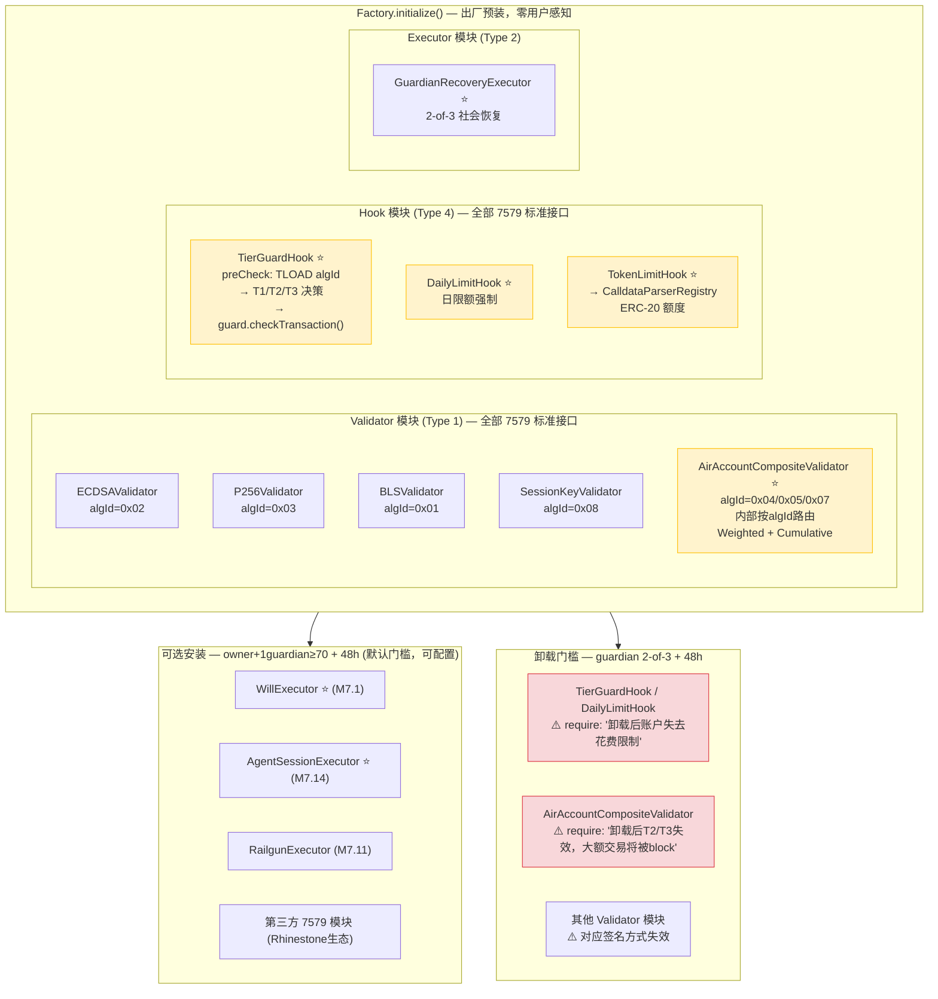
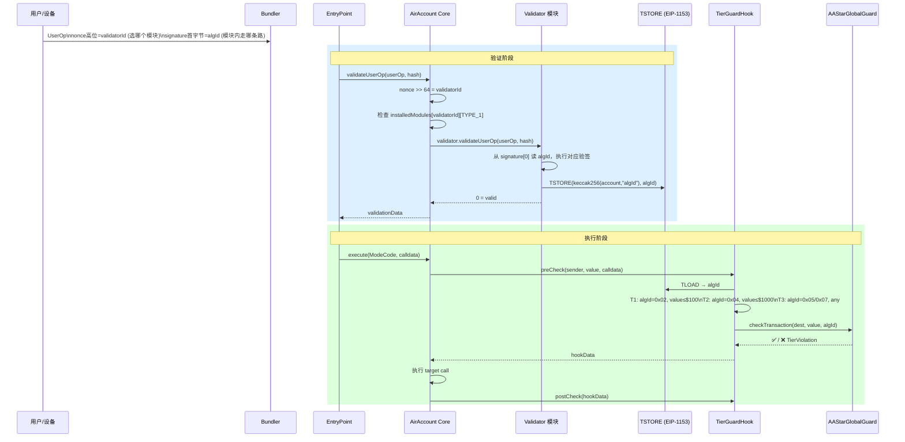
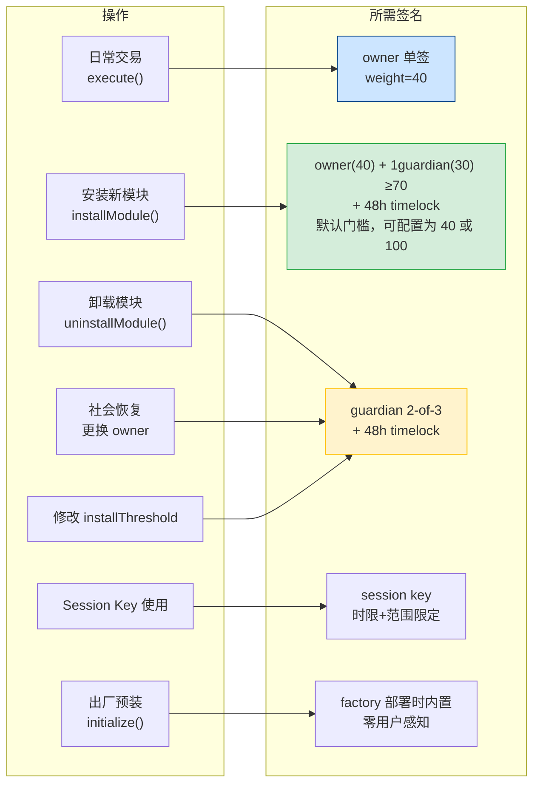

# AirAccount Architecture: ERC-7579 Integration & Stage Evolution

**Document date**: 2026-03-21
**Version**: AirAccount v0.15.0 (M6) → M7 target
**Author**: Architecture Discussion

---

## 核心命题

两条并行演进主线：
1. **ERC-7579 融合**：将 AirAccount 的自定义系统映射到 ERC-7579 模块框架
2. **Stage 0 → 1 → 2 演进**：满足 WalletBeat 的渐进式路线

---

## Diagram 1: ERC-7579 标准模块分类（纯参考）

四种模块类型 + 账户核心的标准关系：



**ERC-7579 刻意留白的内容**（给实现者自定义空间）：
- 社会恢复机制
- 花费限制 / 速率限制
- 签名算法选择逻辑
- 业务策略 / 准入规则
- Paymaster 费用委托

---

## Diagram 2: 理想钱包完整系统架构

包含前端 SDK、后端服务、合约层的全系统视图：



---

## Diagram 3: AirAccount 当前架构 → ERC-7579 映射关系

展示当前组件如何对应到 ERC-7579 模块类型，以及什么是 AirAccount 独有扩展：



**图例**：
- 🟢 绿色 = 通用逻辑，完整映射到标准 ERC-7579 模块接口
- 🟡 黄色 = AirAccount 特有业务逻辑，位于 7579 框架内的自定义空间（接口仍是标准 IValidator/IHook/IExecutor）
- 🔴 红色 = AirAccount 专有特性，7579 框架外，独立维护

---

## Diagram 4: T1/T2/T3 Tier 信号流 — algId 如何穿越验证→执行边界

这是 AirAccount 最独特的架构挑战：algId 在验证阶段产生，但 tier 决策在执行阶段需要。



**关键设计**：
- `ALGID_SLOT = keccak256(abi.encode(account, "algId"))` — 账户隔离，防止跨账户读取
- `TSTORE` / `TLOAD` (EIP-1153, Cancun 已支持) — 零持久存储开销，tx 后自动清除
- Hook 是 ERC-7579 标准接口，只是读取了 AirAccount 自己写入的 transient slot

---

## Diagram 5: AirAccount 架构演进路线

从 M6 现状到 Stage 2 的分阶段演进：



---

## Diagram 6: ERC-7579 下 AirAccount 目标架构全景

M7 完成后的理想架构，展示所有模块的位置和关系：



---

## AirAccount T1/T2/T3 在 ERC-7579 中的定级

| AirAccount 特性 | 7579 位置 | 定级 |
|----------------|-----------|------|
| ECDSA / P256 / BLS 验签 | Validator Module (Type 1) | ✅ **标准模块** — 完全符合 |
| SessionKeyValidator | Validator Module (Type 1) | ✅ **标准模块** — 几乎无需改动 |
| T1/T2/T3 Tier 策略 | Hook Module (Type 4) + TSTORE | 🟡 **7579 框架内自定义** — Hook 是标准接口，tier 逻辑是自定义 |
| 日限额守卫 (AAStarGlobalGuard) | Hook Module (Type 4) | 🟡 **7579 框架内自定义** — 标准 Hook 接口实现花费策略 |
| 加权签名 (Weighted) | Validator Module (Type 1) | 🟡 **7579 框架内自定义** — Validator 模块可实现任意验签逻辑 |
| 累积签名 (Cumulative T2/T3) | Validator Module (Type 1) | 🟡 **7579 框架内自定义** — 多签聚合验证器 |
| 社会恢复 (Guardian 2-of-3) | Executor Module (Type 2) | 🟡 **7579 框架内自定义** — 标准 Executor 接口 |
| algId → tier 信号传递 | Transient Storage (EIP-1153) | 🟡 **7579 框架内自定义** — 利用 Cancun 瞬态存储 |
| EIP-7702 EOA 桥接 | 无对应模块类型 | 🔴 **7579 框架外** — AirAccount 独有，独立维护 |
| OAPD 多DApp地址隔离 | Factory 层（非模块） | 🔴 **7579 框架外** — 部署策略，7579 无此概念 |
| CalldataParserRegistry | Hook 的依赖服务 | 🔴 **7579 框架外** — AirAccount 基础设施，不是模块 |
| WillExecutor (DVT遗嘱) | Executor Module (Type 2) | 🟡 **7579 框架内自定义** — 标准 Executor 接口，业务逻辑是自定义 |

**结论**：AirAccount 的核心创新（T1/T2/T3 tier、weighted/cumulative 签名、OAPD、EIP-7702）都是在 ERC-7579 的合法自定义空间内，或独立于 7579 体系之外。**没有一个特性需要违反 7579 标准**，只是 7579 刻意留空、由实现者填充的部分。

---

## 架构演进行动计划

### Phase A：7579 写接口（M7.2，~3周）

```
当前 (M6)                          目标 (M7.2)
─────────────────────────         ─────────────────────────
AAStarAirAccountBase               AAStarAirAccountBase
  execute()                          validateUserOp() → 路由到 Validator 模块
    → _enforceGuard()                execute() → preCheck Hooks → call → postCheck
  validateUserOp()                   executeFromExecutor() → checkExecutorTx()
    → AAStarValidator (外部)         installModule() (guardian gate + timelock)

AAStarGlobalGuard (外部合约)       TierGuardHook (ERC-7579 Hook 模块)
  checkTransaction(algId)            preCheck() 读 TSTORE algId → 调用 Guard

AAStarValidator (外部合约)         ECDSAValidator / P256Validator (独立模块)
  大型 if-else 算法分发               各自独立 + TSTORE 写入 algId
```

**关键决策**：`AAStarGlobalGuard` 保留为独立合约（已部署、不可升级），但通过 `TierGuardHook` 模块来调用它。这样：
- Guard 的不可变性保留（安全保证）
- AirAccount 对外符合 7579 Hook 接口
- 现有已部署账户不受影响（向后兼容）

### Phase B：审计 + 生态（M7.6 + M7.7，外部依赖）

- 提交代码给 CodeHawks 竞争性审计（$15–20k 奖池）
- 审计范围包含 7579 新增的 installModule + executeFromExecutor 路径
- 审计通过后上线 Immunefi bug bounty

### Phase C：L2 + 生态扩展（M7.5 + M7.11–M7.16）

- 同一 CREATE2 salt → 跨链相同地址（Base / Arbitrum / OP）
- RailgunParser 注册 → 私密转账合规 guard
- Agent Session Key Module → AI Agent 经济基础设施

---

## 快速参考：ERC-7579 关键接口

```solidity
// 账户必须实现
interface IERC7579Account {
    function execute(bytes32 mode, bytes calldata executionCalldata) external payable;
    function executeFromExecutor(bytes32 mode, bytes calldata executionCalldata)
        external payable returns (bytes[] memory returnData);
    function installModule(uint256 moduleTypeId, address module, bytes calldata initData) external payable;
    function uninstallModule(uint256 moduleTypeId, address module, bytes calldata deInitData) external payable;
    function isModuleInstalled(uint256 moduleTypeId, address module, bytes calldata additionalContext)
        external view returns (bool);
    function accountId() external view returns (string memory);
    function supportsExecutionMode(bytes32 encodedMode) external view returns (bool);
    function supportsModule(uint256 moduleTypeId) external view returns (bool);
}

// Validator 模块
interface IERC7579Validator {
    function validateUserOp(PackedUserOperation calldata userOp, bytes32 userOpHash)
        external returns (uint256 validationData);
    function isValidSignatureWithSender(address sender, bytes32 hash, bytes calldata data)
        external view returns (bytes4 magicValue);
}

// Hook 模块
interface IERC7579Hook {
    function preCheck(address msgSender, uint256 value, bytes calldata msgData)
        external returns (bytes memory hookData);
    function postCheck(bytes calldata hookData) external;
}

// 所有模块基类
interface IERC7579Module {
    function onInstall(bytes calldata data) external;
    function onUninstall(bytes calldata data) external;
    function isModuleType(uint256 typeID) external view returns (bool);
}

// ModeCode 模块类型常量
uint256 constant MODULE_TYPE_VALIDATOR = 1;
uint256 constant MODULE_TYPE_EXECUTOR  = 2;
uint256 constant MODULE_TYPE_FALLBACK  = 3;
uint256 constant MODULE_TYPE_HOOK      = 4;

// ModeCode callType 常量
bytes1 constant CALLTYPE_SINGLE      = 0x00;
bytes1 constant CALLTYPE_BATCH       = 0x01;
bytes1 constant CALLTYPE_STATICCALL  = 0xFE;
bytes1 constant CALLTYPE_DELEGATECALL = 0xFF;
```

---

## 架构决策确认版 (2026-03-21 Review)

以下三图是经过充分讨论后的确认版架构，作为 M7.2 实现依据。

---

### 确认图A：模块全景 — 出厂预装 vs 可选安装



> ⭐ = AirAccount 特有业务逻辑，接口符合 7579 标准（IValidator / IHook / IExecutor）

---

### 确认图B：UserOp 执行全链路 — algId 信号流



---

### 确认图C：权限矩阵



---

### 确认决策表

| 决策点 | 结论 | 依据 |
|--------|------|------|
| algId 跨阶段传递 | nonce高位选validator + TSTORE传algId（两者配合，非替代） | TSTORE ~200gas，零持久存储，Cancun已支持 |
| Validator 拆分 | ECDSA/P256/BLS/Session 独立 + Weighted+Cumulative 合并为 AirAccountCompositeValidator | 拆分粒度合理，CompositeValidator 内部按algId路由不违反7579 |
| CompositeValidator 卸载 | 允许（guardian 2-of-3），合约内 require 提示后果 | safe-fail：卸载后大额tx被block，不产生安全漏洞 |
| installModule 门槛 | 默认 owner+1guardian≥70 + 48h，可在创建时配置为 40/70/100 | 主流（Kernel/Nexus）单签即可；AirAccount 加一道人工防线；普通用户永不触碰 |
| uninstallModule 门槛 | guardian 2-of-3 + 48h（与社会恢复同等重量） | 卸载安全模块的风险高于安装 |
| TierGuardHook 安全性 | 不可被 owner 单签卸载，guardian 2-of-3 才能卸载 | 日限额是最后安全底线 |
| ★ 标注含义澄清 | 所有模块均符合 7579 接口标准；⭐ 仅表示"AirAccount 特有业务逻辑" | 7579 只规定接口，不限制内部逻辑 |

---

## 参考资料

- [ERC-7579 官方规范](https://eips.ethereum.org/EIPS/eip-7579)
- [Rhinestone ModuleKit](https://github.com/rhinestonewtf/modulekit)
- [Rhinestone Core Modules](https://github.com/rhinestonewtf/core-modules)
- [ZeroDev Kernel v3](https://github.com/zerodevapp/kernel)
- [Biconomy Nexus](https://github.com/bcnmy/nexus)
- [ERC-7579 参考实现](https://github.com/erc7579/erc7579-implementation)
- [ERC-7484 模块注册表](https://eips.ethereum.org/EIPS/eip-7484)
- [EIP-1153 瞬态存储](https://eips.ethereum.org/EIPS/eip-1153)
