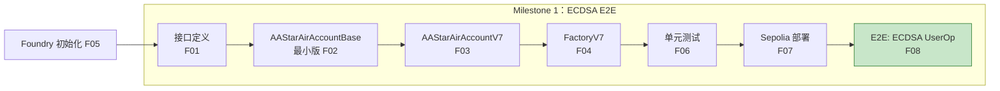
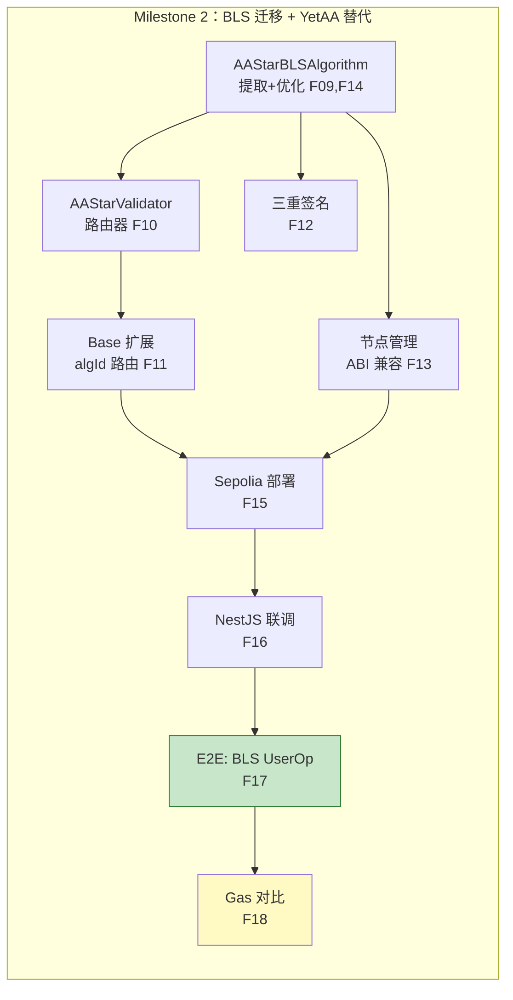
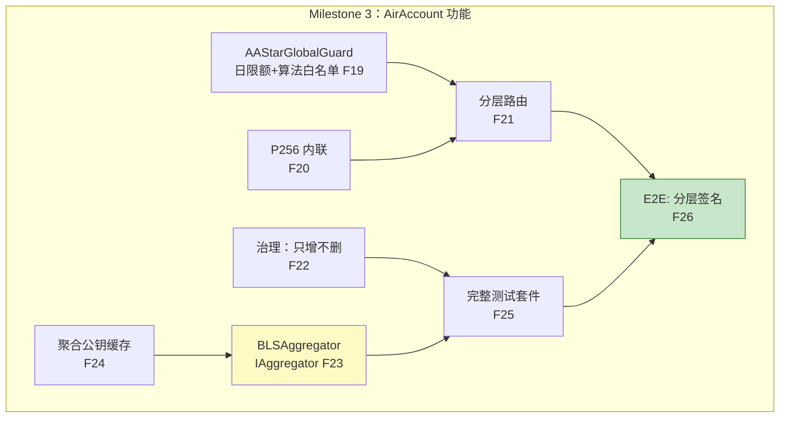
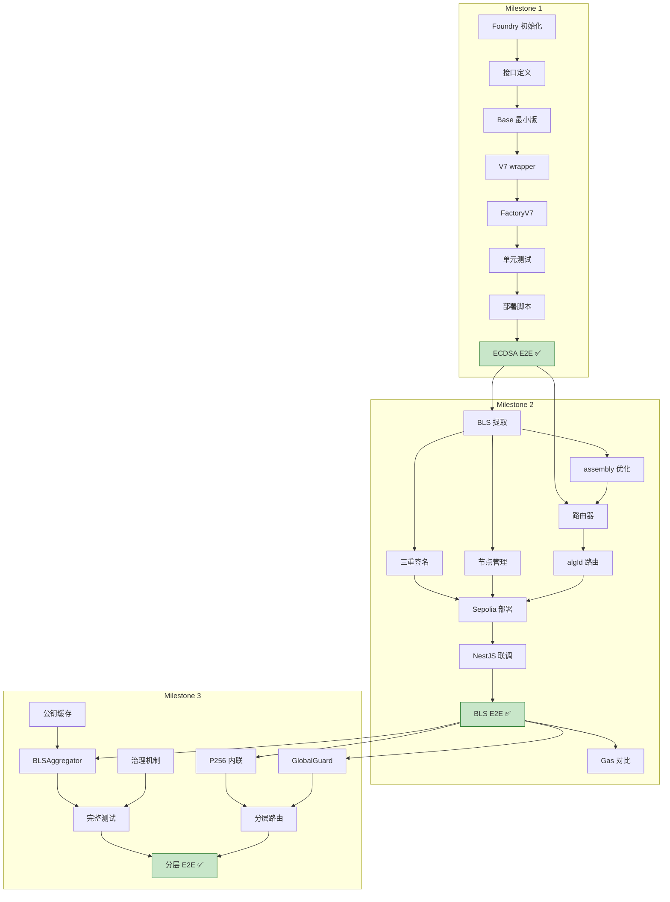

# AirAccount v0.12.5 开发里程碑计划

> **[ARCHIVED — 2026-03-13]** v0.12.5 完整完成。M1-M4 全部通过 Sepolia E2E 验证。
> 203 Foundry unit tests + 15 Sepolia E2E tests ALL PASSED.
> 当前开发在 M5 分支继续，参考 `docs/M5-plan.md`。

> 分支：`v0.12.5`
> 备份分支：`yetaa-sepolia-verified`（YetAnotherAA Sepolia 部署 + E2E 测试通过的快照）
> 关联文档：[统一架构](./airaccount-unified-architecture.md) | [Validator/PQ 分析](./validator-upgrade-pq-analysis.md) | [Gas 优化](./gas-optimization-plan.md)

---

## 目标

完整替代 YetAnotherAA 链上合约，实现 AirAccount 基础功能，最终目标：

> **在 Sepolia 上通过 EntryPoint v0.7 提交一笔完整的 UserOperation，
> 使用新的 AirAccount 合约体系 + YetAnotherAA NestJS 服务（BLS 签名），
> 端到端跑通。**

---

## 特性总览

### 完整特性列表（按里程碑分配）

| # | 特性 | 类型 | 里程碑 | 复杂度 |
|---|------|------|--------|--------|
| F01 | `IAAStarValidator` / `IAAStarAlgorithm` 接口定义 | 接口 | M1 | 简单 |
| F02 | `AAStarAirAccountBase` 最小版本（execute/executeBatch + ECDSA 内联验证） | 核心 | M1 | 中等 |
| F03 | `AAStarAirAccountV7` EntryPoint v0.7 薄包装 | 核心 | M1 | 简单 |
| F04 | `AAStarAirAccountFactoryV7` CREATE2 部署 + getAddress | 核心 | M1 | 中等 |
| F05 | Foundry 项目初始化（foundry.toml、remappings、测试框架） | 工程 | M1 | 简单 |
| F06 | 基础单元测试（创建账户、ECDSA 验证、execute） | 测试 | M1 | 中等 |
| F07 | Sepolia 部署脚本 | 部署 | M1 | 简单 |
| F08 | E2E：ECDSA 签名 UserOp → handleOps 上链 | E2E | M1 | 中等 |
| F09 | `AAStarBLSAlgorithm` 从 YetAnotherAA 提取 BLS 验证逻辑 | 迁移 | M2 | 复杂 |
| F10 | `AAStarValidator` 通用路由器（algId 路由 + 算法注册表） | 核心 | M2 | 中等 |
| F11 | `AAStarAirAccountBase` 扩展：algId 路由分发（内联 vs 外部 call） | 核心 | M2 | 中等 |
| F12 | 三重签名验证（ECDSA×2 + BLS 聚合）完整移植 | 迁移 | M2 | 复杂 |
| F13 | BLS 节点管理（registerPublicKey / revoke / batch / query）ABI 兼容 | 迁移 | M2 | 中等 |
| F14 | BLS assembly 优化（mstore 替代逐字节拷贝，view 替代 state-changing） | 优化 | M2 | 复杂 |
| F15 | Sepolia 部署新合约 + 注册测试节点 | 部署 | M2 | 简单 |
| F16 | NestJS 联调：修改 `VALIDATOR_CONTRACT_ADDRESS` 指向新合约 | 集成 | M2 | 简单 |
| F17 | E2E：BLS 三重签名 UserOp → NestJS 签名 → handleOps 上链 | E2E | M2 | 复杂 |
| F18 | Gas 对比报告：新合约 vs YetAnotherAA 原合约 | 分析 | M2 | 简单 |
| F19 | `AAStarGlobalGuard` 基础版（每日限额 + 算法白名单） | 核心 | M3 | 中等 |
| F20 | P256 WebAuthn passkey 内联验证（algId=0x03） | 核心 | M3 | 中等 |
| F21 | 分层验证路由：按交易金额自动选择 Tier 1/2/3 验证器 | 核心 | M3 | 中等 |
| F22 | 算法注册治理：只增不删 + 7 天时间锁 | 治理 | M3 | 中等 |
| F23 | `AAStarBLSAggregator` IAggregator 批量验证 | 优化 | M3 | 复杂 |
| F24 | 聚合公钥缓存（cachedAggKeys） | 优化 | M3 | 中等 |
| F25 | 完整测试套件（单元 + 集成 + E2E，覆盖全路径） | 测试 | M3 | 复杂 |
| F26 | E2E：分层签名 UserOp（小额 ECDSA + 大额 BLS）全流程 | E2E | M3 | 复杂 |
| F27 | 外部 Paymaster 联调：gasless 交易 E2E（VerifyingPaymaster 或 Pimlico） | E2E | M3 | 中等 |
| F28 | 社交恢复：2/3 多签换钥（2 个用户签名者 + 1 个社区 3/5 Safe 守护者） | 核心 | M3 | 复杂 |

---

## 里程碑详情

### Milestone 1：核心账户 + ECDSA E2E（最小可行）

**目标**：部署最简版 AirAccount，用 ECDSA 签名提交 UserOp 上链。

**为什么先做这个**：
- ECDSA 验证最简单（ecrecover 一行），排除 BLS 复杂性
- 验证账户+工厂+EntryPoint 交互是否正确
- 建立 Foundry 项目骨架和测试框架
- 成功后再叠加 BLS，避免同时调试多个复杂模块



#### 特性清单

| # | 特性 | 产出 | 验收标准 |
|---|------|------|---------|
| F05 | Foundry 项目初始化 | `foundry.toml`、remappings、目录结构 | `forge build` 通过 |
| F01 | 接口定义 | `IAAStarValidator.sol`、`IAAStarAlgorithm.sol` | 编译通过 |
| F02 | AAStarAirAccountBase 最小版 | `src/core/AAStarAirAccountBase.sol` | 包含：owner/signer 管理、`_validateECDSA()` 内联、`execute()`/`executeBatch()`、`receive()` |
| F03 | AAStarAirAccountV7 | `src/core/AAStarAirAccountV7.sol` | `validateUserOp()` → 调用 Base 验证 → `_payPrefund()` |
| F04 | AAStarAirAccountFactoryV7 | `src/core/AAStarAirAccountFactoryV7.sol` | `createAccount()` CREATE2、`getAddress()` counterfactual |
| F06 | 基础单元测试 | `test/AAStarAirAccountV7.t.sol`、`test/AAStarAirAccountFactoryV7.t.sol` | 覆盖：创建、ECDSA 验证成功/失败、execute、batch、counterfactual 地址一致 |
| F07 | 部署脚本 | `script/DeployAirAccountV7.s.sol` | Sepolia 部署成功 |
| F08 | ECDSA E2E | `scripts/test-e2e-ecdsa.ts` | UserOp 通过 handleOps 上链，Etherscan 可查 |

#### Base 最小版伪代码

```solidity
abstract contract AAStarAirAccountBase {
    address public immutable owner;       // = signer for M1
    address public immutable entryPoint;

    // M1: 只有 ECDSA 内联
    function _validateSignature(bytes32 hash, bytes calldata sig)
        internal view returns (uint256)
    {
        return ECDSA.recover(hash.toEthSignedMessageHash(), sig) == owner ? 0 : 1;
    }

    function execute(address dest, uint256 value, bytes calldata func) external { ... }
    function executeBatch(...) external { ... }
    receive() external payable {}
}
```

---

### Milestone 2：BLS 迁移 + YetAnotherAA 完整替代

**目标**：提取 YetAnotherAA 的 BLS 验证能力，assembly 优化，部署后与 NestJS 联调，BLS 三重签名 UserOp E2E 上链。

**为什么第二步**：
- 基于 M1 已验证的账户+工厂骨架
- BLS 验证是整个体系最复杂的部分，集中精力
- NestJS 联调是替代 YetAnotherAA 的关键验证点



#### 特性清单

| # | 特性 | 产出 | 验收标准 |
|---|------|------|---------|
| F09 | AAStarBLSAlgorithm | `src/validators/AAStarBLSAlgorithm.sol` | 从 `AAStarValidator.sol` 提取：`_validateBLSSignature`、`_buildPairingData`、`_negateG1Point`、`verifyAggregateSignature` |
| F14 | BLS assembly 优化 | 同上 | `_buildPairingDataAssembly` 用 mstore/calldatacopy 替代逐字节拷贝；验证改为 view（去掉事件） |
| F10 | AAStarValidator 路由器 | `src/validators/AAStarValidator.sol` | `algorithms[algId]` 注册表、`validateSignature(hash, sig)` → `sig[0]` 路由、`registerAlgorithm()` |
| F11 | Base algId 路由 | 更新 `AAStarAirAccountBase.sol` | `algId==0x02` → 内联 ECDSA；`algId==0x01` → external call 路由器 |
| F12 | 三重签名 | 更新 `AAStarBLSAlgorithm.sol` | `_parseAAStarSignature()` 解析签名格式、ECDSA×2 验证 + BLS 聚合验证 |
| F13 | 节点管理 ABI 兼容 | `AAStarBLSAlgorithm.sol` | `registerPublicKey(bytes32, bytes)`、`updatePublicKey`、`revokePublicKey`、`batchRegisterPublicKeys`、`getRegisteredNodes`、`getRegisteredNodeCount`、`isRegistered`、`getGasEstimate` — 函数签名与 YetAA 完全一致 |
| F15 | Sepolia 部署 | 部署脚本更新 | 部署 AAStarValidator + AAStarBLSAlgorithm + 注册路由 + 注册测试节点 |
| F16 | NestJS 联调 | 环境变量修改 | YetAnotherAA NestJS 服务 `VALIDATOR_CONTRACT_ADDRESS` 指向新 BLSAlgorithm 地址，API 调用通过 |
| F17 | BLS E2E | `scripts/test-e2e-bls-new.ts` | 完整流程：App → NestJS 获取 BLS 签名 → 打包三重签名 → handleOps → 链上执行成功 |
| F18 | Gas 对比 | 更新 `gas-optimization-plan.md` | 新合约 vs YetAA 原合约逐项 gas 对比表 |

#### 关键设计：ABI 兼容

```
NestJS 调用的合约接口（必须保持一致）：

  registerPublicKey(bytes32 nodeId, bytes calldata publicKey)  ← 函数签名不变
  isRegistered(bytes32 nodeId) returns (bool)                   ← 不变
  getRegisteredNodes() returns (bytes32[])                      ← 不变
  getRegisteredNodeCount() returns (uint256)                    ← 不变

NestJS 只需修改一个环境变量：
  VALIDATOR_CONTRACT_ADDRESS=<AAStarBLSAlgorithm 新地址>

零代码改动 → 方案 B 迁移
```

#### BLS Assembly 优化目标

```
当前 YetAnotherAA（Sepolia 实测）：
  handleOps 总计          = 523,306 gas
  BLS verifyAggregate     = 407,730 gas
    其中 Pairing 预编译   = 102,900 gas（不可压缩）
    其中 EVM 开销         = 304,455 gas（优化目标）

优化后目标：
  EVM 开销 304k → ~50k（assembly mstore 替代逐字节拷贝）
  总 BLS 验证 407k → ~160k
  handleOps 523k → ~280k（-46%）
```

---

### Milestone 3：AirAccount 基础功能 + 批量优化

**目标**：实现 AirAccount 区别于 YetAnotherAA 的核心特性：日限额、分层验证、P256 passkey、IAggregator 批量。



#### 特性清单

| # | 特性 | 产出 | 验收标准 |
|---|------|------|---------|
| F19 | AAStarGlobalGuard | `src/core/AAStarGlobalGuard.sol` | `checkTransaction(value, algId)` 日限额检查 + 算法白名单；`approvedAlgorithms` mapping；`dailySpent` 跟踪 |
| F20 | P256 内联 | 更新 `AAStarAirAccountBase.sol` | `algId==0x03` → `_validateP256()` 调用 EIP-7212 预编译；测试覆盖 passkey 验证 |
| F21 | 分层路由 | 更新 `AAStarAirAccountBase.sol` | `_selectAlgorithm(txValue)` 按金额自动选择 Tier；Factory 支持 ValidatorSlot[3] 配置 |
| F22 | 治理机制 | 更新 `AAStarValidator.sol` | `proposeAlgorithm()` 7 天时间锁、`registerAlgorithm()` 只增不删、`algorithms[algId]` 注册后不可更改 |
| F23 | AAStarBLSAggregator | `src/aggregator/AAStarBLSAggregator.sol` | 实现 `IAggregator.validateUserOpSignature()`、`aggregateSignatures()`、`validateSignatures()`；3 UserOps 共享一次 pairing |
| F24 | 聚合公钥缓存 | 更新 `AAStarBLSAlgorithm.sol` | `cachedAggKeys[setHash]`：相同节点集合命中缓存时跳过 G1Add 计算 |
| F25 | 完整测试套件 | `test/*.t.sol` 扩展 | 覆盖：ECDSA/P256/BLS 三条路径、GlobalGuard 限额拦截、Factory 幂等、Aggregator 批量、治理时间锁 |
| F26 | 分层 E2E | `scripts/test-e2e-tiered.ts` | 小额 UserOp → ECDSA 验证（3k gas）；大额 UserOp → BLS 三重签名（~160k gas）；超限额 → 拒绝 |
| F27 | Paymaster gasless E2E | `scripts/test-e2e-paymaster.ts` | 使用外部 VerifyingPaymaster（Pimlico/StackUp）或自部署 Paymaster，提交 gasless UserOp，用户 0 gas 成本完成交易 |
| F28 | 社交恢复 | `src/core/AAStarAirAccountBase.sol` + `test/SocialRecovery.t.sol` | 账户默认 2+ 签名者（passkey×2 或 passkey+EOA）+ 1 社区守护者（3/5 Safe 多签）；更换私钥需至少 2/3 签名（含时间锁）；测试覆盖：正常恢复、单签拒绝、守护者投票 |

---

## 依赖关系总图



---

## 合约文件清单（最终）

```
src/
├── interfaces/
│   ├── IAAStarValidator.sol          ← M1: 路由器接口
│   └── IAAStarAlgorithm.sol          ← M1: 算法实现接口
├── core/
│   ├── AAStarAirAccountBase.sol      ← M1: 最小版 → M2: algId 路由 → M3: 分层+Guard
│   ├── AAStarAirAccountV7.sol        ← M1
│   ├── AAStarAirAccountFactoryV7.sol ← M1
│   └── AAStarGlobalGuard.sol         ← M3
├── validators/
│   ├── AAStarValidator.sol           ← M2: 路由器 → M3: 治理时间锁
│   └── AAStarBLSAlgorithm.sol        ← M2: BLS 提取 + assembly 优化
└── aggregator/
    └── AAStarBLSAggregator.sol       ← M3

test/
├── AAStarAirAccountV7.t.sol          ← M1
├── AAStarAirAccountFactoryV7.t.sol   ← M1
├── AAStarBLSAlgorithm.t.sol          ← M2
├── AAStarValidator.t.sol             ← M2
├── AAStarGlobalGuard.t.sol           ← M3
└── AAStarBLSAggregator.t.sol         ← M3

script/
├── DeployAirAccountV7.s.sol          ← M1
└── DeployFullSystem.s.sol            ← M2

scripts/
├── test-e2e-ecdsa.ts                 ← M1 E2E
├── test-e2e-bls-new.ts               ← M2 E2E
└── test-e2e-tiered.ts                ← M3 E2E
```

---

## 风险与注意事项

| 风险 | 影响 | 缓解 |
|------|------|------|
| EIP-7212 P256 预编译 Sepolia 不可用 | M3 P256 功能无法测试 | 用 mock 预编译合约测试；或改在支持 EIP-7212 的 L2 测试网部署 |
| BLS assembly 优化引入 bug | 签名验证错误 | 用 YetAnotherAA 原合约做 differential testing，相同输入对比输出 |
| NestJS ABI 不兼容 | 联调失败 | M2 开始前先用 `cast` 对比新旧合约的函数签名哈希 |
| EntryPoint v0.7 接口细节遗漏 | UserOp 验证失败 | 参考 `lib/account-abstraction` 和 `lib/light-account` 的成功实现 |

---

## 不在 v0.12.5 范围内

以下特性在 v0.12.5 中**不实现**，留给后续版本：

- AAStarAirAccountV8/V9 + 对应工厂
- Optimism 主网部署
- PQ 算法实现（等 EIP-8051）
- 隐私集成（Railgun/Kohaku）
- 多签治理合约（紧急多签、社区投票）
- 版本迁移流程（V7 → V8 资产转移）
- One-Account-Per-DApp (OAPD)

---

*2026-03-09*
