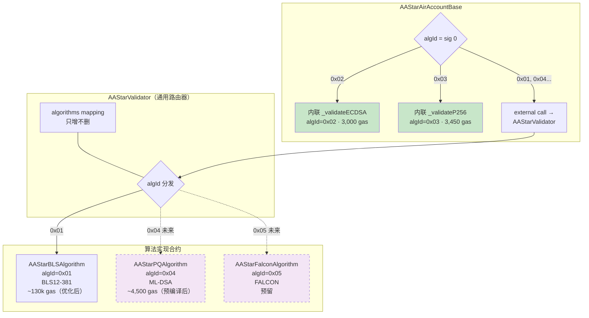
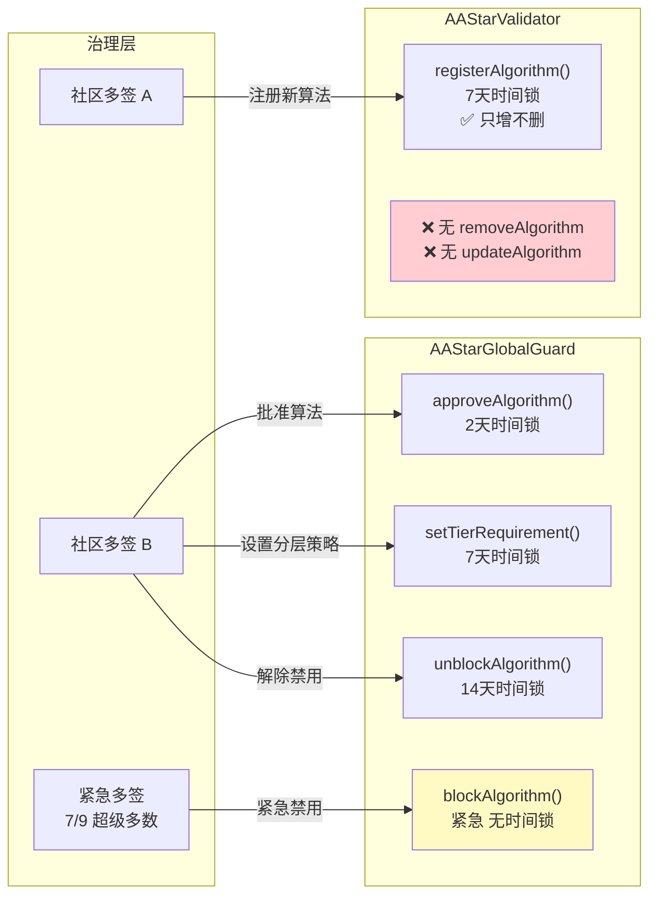
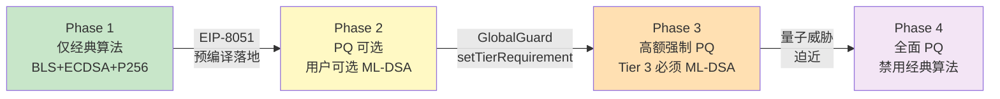
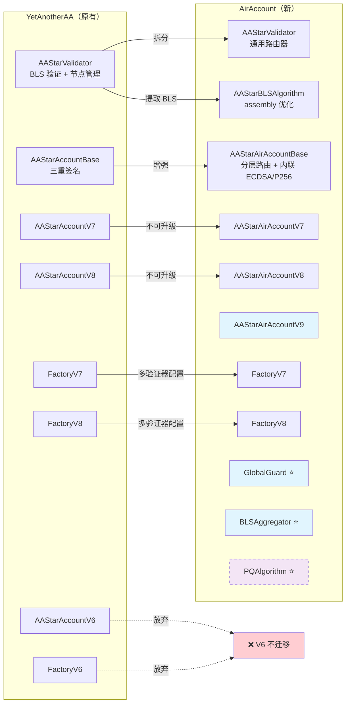

# Validator 升级架构与抗量子（PQ）迁移分析

> 本文档记录 AirAccount Validator 架构讨论、抗量子签名技术调研、治理安全设计。
> 关联文档：[统一架构设计](./airaccount-unified-architecture.md) | [Gas 优化方案](./gas-optimization-plan.md)

---

## 总览：Validator 路由与 PQ 迁移架构图

### Validator 路由器架构



### 治理安全：单调安全 + 职责分离



### PQ 迁移四阶段



### YetAnotherAA → AirAccount 迁移映射



---

## 一、Validator 架构：路由器 + 算法合约

### 核心决策

Validator 不是单一的 BLS 验证器，而是**通用算法路由器**。账户合约存储的是路由器地址，路由器根据签名前缀分发到具体算法实现。

### 命名规范（修订版）

| 合约 | 角色 | 说明 |
|------|------|------|
| **`AAStarValidator`** | 通用路由器 | 维护算法注册表，根据 `sig[0]` 路由到具体实现 |
| `AAStarBLSAlgorithm` | BLS12-381 实现 | algId = 0x01，从 YetAnotherAA 提取 + assembly 优化 |
| ~~`AAStarP256Algorithm`~~ | ~~P256 实现~~ | **内联到 Base**（见下方分析） |
| ~~`AAStarK1Algorithm`~~ | ~~ECDSA 实现~~ | **内联到 Base**（见下方分析） |
| `AAStarPQAlgorithm` | 抗量子实现（预留） | algId = 0x04，等 EIP-8051 预编译落地后实现 |

### 路由器合约设计

```solidity
contract AAStarValidator {
    // 算法注册表（只增不删）
    mapping(uint8 => address) public algorithms;

    // 社区多签地址
    address public communityMultisig;

    // 时间锁：algId → 解锁时间
    mapping(uint8 => uint256) public pendingUnlock;

    /// @dev 路由验证：读取签名第一个字节作为算法 ID
    function validateSignature(
        bytes32 userOpHash,
        bytes calldata signature
    ) external view returns (uint256 validationData) {
        uint8 algId = uint8(signature[0]);
        address impl = algorithms[algId];
        require(impl != address(0), "unknown algorithm");
        return IAlgorithm(impl).validate(userOpHash, signature[1:]);
    }

    /// @dev 注册新算法（只增不删，注册后永久不可更改）
    function registerAlgorithm(uint8 algId, address impl) external {
        require(msg.sender == communityMultisig, "only multisig");
        require(algorithms[algId] == address(0), "already registered");
        require(block.timestamp >= pendingUnlock[algId], "timelocked");
        algorithms[algId] = impl;
        emit AlgorithmRegistered(algId, impl);
    }

    /// @dev 发起注册提案（启动 7 天时间锁）
    function proposeAlgorithm(uint8 algId, address impl) external {
        require(msg.sender == communityMultisig, "only multisig");
        require(algorithms[algId] == address(0), "already registered");
        pendingUnlock[algId] = block.timestamp + 7 days;
        emit AlgorithmProposed(algId, impl, pendingUnlock[algId]);
    }

    // ═══ 没有 removeAlgorithm ═══
    // ═══ 没有 updateAlgorithm ═══
    // 安全原则：只能增加算法，永远不能删除或修改
}
```

### 签名格式

```
新格式（+1 byte 前缀）：
  [algId(1)][算法特定签名数据...]

  algId = 0x00 → 保留（向后兼容，走默认 BLS 路径）
  algId = 0x01 → BLS12-381 三重签名
  algId = 0x02 → ECDSA secp256k1（内联，不走路由器）
  algId = 0x03 → P256 WebAuthn passkey（内联，不走路由器）
  algId = 0x04 → ML-DSA / Dilithium（预留）
  algId = 0x05 → FALCON（预留）
```

---

## 二、内联 vs 外部调用决策

### 决策原则

轻量算法（代码 < 20 行、无状态）→ 内联到 AirAccountBase
重量算法（复杂逻辑、有状态管理）→ 外部合约 + 路由器调用

### 逐算法分析

| 算法 | 验证核心代码 | 需要状态？ | 验证 gas | external call 开销 | 开销占比 | 决策 |
|------|------------|-----------|---------|-------------------|---------|------|
| **ECDSA (K1)** | `ecrecover(hash,v,r,s) == signer` | 否 | 3,000 | 2,600 | **87%** | **内联** ✅ |
| **P256** | `P256.verifySignature(hash,r,s,qx,qy)` via EIP-7212 | 否 | 3,450 | 2,600 | **75%** | **内联** ✅ |
| **BLS** | 多预编译 + 节点注册表 + 聚合逻辑 | **是**（节点、公钥） | 407,000 | 2,600 | **0.6%** | **外部** |
| **ML-DSA** | 预编译调用（EIP-8051） | 否 | 4,500（预编译后） | 2,600 | **58%** | **内联**（未来） |

### ECDSA 内联实现

```solidity
// 在 AAStarAirAccountBase 中直接实现
function _validateECDSA(
    bytes32 userOpHash,
    bytes calldata signature
) internal view returns (uint256) {
    bytes32 hash = MessageHashUtils.toEthSignedMessageHash(userOpHash);
    address recovered = ECDSA.recover(hash, signature);
    return recovered == signer ? 0 : 1;
}
```

### P256 内联实现

```solidity
// 在 AAStarAirAccountBase 中直接实现
function _validateP256(
    bytes32 userOpHash,
    bytes calldata signature
) internal view returns (uint256) {
    // signature = [r(32)][s(32)]
    bytes32 r = bytes32(signature[0:32]);
    bytes32 s = bytes32(signature[32:64]);
    // EIP-7212 precompile at 0x100
    (bool success, bytes memory result) = address(0x100).staticcall(
        abi.encode(userOpHash, r, s, passkeyQx, passkeyQy)
    );
    return (success && abi.decode(result, (bool))) ? 0 : 1;
}
```

### 为什么 BLS 不应内联

1. **有状态**：BLS 验证需要查询节点注册表（`registeredKeys`、`registeredNodes`），这些 mapping 不适合放在每个用户账户中
2. **代码量大**：pairing 数据构建、G1 点取反、聚合公钥计算 = 数百行代码，内联会使账户部署 gas 增加约 50%
3. **共享性**：所有用户共享同一组 BLS 节点，独立合约天然支持
4. **开销可忽略**：2,600 / 407,000 = 0.6%，完全不值得优化

### 最终的分层验证路由

```solidity
// AAStarAirAccountBase.sol
function _validateSignatureWithTieredRouting(
    bytes32 userOpHash,
    bytes calldata signature,
    bytes calldata callData
) internal view returns (uint256 validationData) {
    uint256 txValue = _extractTransactionValue(callData);
    _checkGlobalGuard(txValue);

    uint8 algId = uint8(signature[0]);

    if (algId == 0x02) {
        // Tier 1/2: ECDSA — 内联，3,000 gas
        return _validateECDSA(userOpHash, signature[1:]);
    } else if (algId == 0x03) {
        // Tier 1: P256 passkey — 内联，3,450 gas
        return _validateP256(userOpHash, signature[1:]);
    } else {
        // Tier 3+: 走路由器（BLS, PQ, 未来算法）
        return IAAStarValidator(aastarValidator).validateSignature(
            userOpHash, signature  // 包含 algId，路由器自己解析
        );
    }
}
```

---

## 三、抗量子签名技术调研

### 以太坊 PQ 现状（截至 2026-03）

| 事项 | 状态 | 说明 |
|------|------|------|
| EF Post Quantum 团队 | ✅ 已成立 | Thomas Coratger 领导，2026.01.24 公布 |
| All Core Devs PQ 讨论会 | ✅ 已启动 | 首次 breakout room 2026.02.04 |
| EIP-8051: ML-DSA 预编译 | 📝 草案 | ML-DSA (Dilithium) 验证预编译 |
| 共识层 PQ 路线图 | 📋 规划中 | 7-fork "Strawmap"，目标 ~2029 |
| 正式选定算法 | ❌ 未定 | 执行层和共识层可能用不同方案 |

### NIST 标准化的 PQ 签名算法

```
┌─ 格基（Lattice-based）─────────────────────────────────┐
│                                                         │
│  ML-DSA (原 CRYSTALS-Dilithium) — FIPS 204             │
│    安全假设：Module Learning With Errors (MLWE)          │
│    特点：签名较小(2,420B)、验证快、密钥较大(1,312B)       │
│    以太坊：EIP-8051 提议预编译                            │
│                                                         │
│  FALCON — 标准化延期中                                   │
│    安全假设：NTRU lattice                                │
│    特点：签名最小(666B)、签名生成需要浮点运算              │
│    以太坊：ETHFALCON 优化实现 1.9M gas                    │
│                                                         │
│  ⚠️ 不是哈希算法！是基于格（lattice）数学难题             │
└─────────────────────────────────────────────────────────┘

┌─ 哈希基（Hash-based）──────────────────────────────────┐
│                                                         │
│  SLH-DSA (原 SPHINCS+) — FIPS 205                      │
│    安全假设：哈希函数单向性（最保守）                      │
│    特点：无状态、签名大(7,856-49,216B)、验证慢             │
│    以太坊：Vitalik 提议共识层用 Winternitz 变体           │
│                                                         │
│  W-OTS+ / XMSS                                         │
│    安全假设：哈希函数单向性                               │
│    特点：有状态（每个密钥只能签有限次）、签名较小           │
│                                                         │
│  ✅ 这是"抗量子哈希算法"                                  │
└─────────────────────────────────────────────────────────┘

┌─ 多变量（Multivariate）───────────────────────────────┐
│  MAYO — 较新候选                                        │
│    poqeth 项目评估中                                     │
└─────────────────────────────────────────────────────────┘
```

### 链上验证 Gas 成本对比

#### 无预编译（纯 EVM 实现）

| 算法 | 纯 Solidity | 优化实现 | 可行性 | 来源 |
|------|------------|---------|--------|------|
| **FALCON-512** | **5 亿 gas** | **190 万 gas**（ETHFALCON Yul） | ⚠️ L2 勉强可行 | [ETHFALCON](https://zknox.eth.limo/posts/2025/03/21/ETHFALCON.html) |
| **ML-DSA** | 估算数千万 | 无公开优化实现 | ❌ 不可行 | — |
| **SPHINCS+** | 数千万 | poqeth 评估中 | ❌ 不可行 | [poqeth](https://eprint.iacr.org/2025/091.pdf) |
| **W-OTS+** | 较低（纯哈希） | poqeth 评估中 | ⚠️ 可能可行 | [poqeth](https://eprint.iacr.org/2025/091.pdf) |
| **BLS（对比）** | — | 407,000 gas | ✅ 可行 | 本项目实测 |
| **ECDSA（对比）** | — | 3,000 gas | ✅ 可行 | 预编译 |

**结论：没有预编译，PQ 签名链上验证完全不可行。**

#### 有预编译（未来）

| 算法 | 预编译 gas | EIP | 状态 | 对比 ECDSA (3,000) |
|------|-----------|-----|------|-------------------|
| **ML-DSA** | **4,500 gas** | EIP-8051 | 草案 | 1.5× |
| **FALCON** | **~1,200 gas** | 未正式提案 | 研究中 | 0.4× (**更便宜**) |
| **BLS pairing（对比）** | 102,900 gas | 已有 (EIP-2537) | 生产 | 34× |

**结论：预编译落地后，PQ 验证将比 BLS 便宜 20-80 倍。**

### 链下签名成本

| 算法 | 签名时间 | 签名大小 | 公钥大小 | 安全级别 |
|------|---------|---------|---------|---------|
| **ML-DSA-44** | ~0.5 ms | 2,420 B | 1,312 B | NIST Level 2 |
| **FALCON-512** | ~0.3 ms | 666 B | 897 B | NIST Level 1 |
| **SPHINCS+-128s** | ~50 ms | 7,856 B | 32 B | NIST Level 1 |
| ECDSA secp256k1 | ~0.1 ms | 65 B | 33 B | ~128-bit 经典 |
| BLS12-381 | ~1 ms | 48 B | 96 B | ~128-bit 经典 |

链下计算成本可忽略，瓶颈完全在链上验证和 calldata 成本（签名越大 calldata 越贵）。

### AirAccount 的 PQ 策略

```
现阶段（2026）：
  ✅ 架构预留 PQ 算法槽位（algId = 0x04, 0x05）
  ✅ AAStarValidator 路由器设计支持动态注册算法
  ❌ 不实现 PQ 验证（链上成本不可行）
  ❌ 不部署 PQ 算法合约

等待条件：
  → EIP-8051 (ML-DSA 预编译) 进入 Accepted 状态
  → 或其他 PQ 签名预编译被纳入硬分叉

触发后行动：
  1. 部署 AAStarPQAlgorithm（调用预编译，~20 行代码）
  2. 社区多签提案：AAStarValidator.proposeAlgorithm(0x04, PQAlgorithm)
  3. 7 天时间锁等待
  4. 执行注册
  5. GlobalGuard 批准 algId 0x04
  6. 链下节点 + SDK 同步更新
  7. 用户零操作，自动获得 PQ 能力
```

---

## 四、治理安全：单调安全设计

### 核心原则

**安全等级只能升不能降**。即使治理多签被盗，攻击者无法降低任何账户的安全性。

### 职责分离

```
AAStarValidator（算法注册）          AAStarGlobalGuard（策略控制）
  控制者：社区多签 A                    控制者：社区多签 B（可以是同一个）
  能做：注册新算法                      能做：批准/禁用算法、调整限额
  不能做：删除/修改已注册算法            不能做：注册新算法

  被盗后果：                            被盗后果：
    最坏 = 注册一个无用算法               最坏 = 禁用某算法（DoS）
    用户无影响（GlobalGuard 未批准）      用户无法交易但资产安全
```

### AAStarValidator：只增不删

```solidity
contract AAStarValidator {
    mapping(uint8 => address) public algorithms;

    // ✅ 可以注册
    function registerAlgorithm(uint8 algId, address impl) external onlyMultisig {
        require(algorithms[algId] == address(0), "immutable once set");
        algorithms[algId] = impl;
    }

    // ❌ 没有 removeAlgorithm
    // ❌ 没有 updateAlgorithm
    // 注册后永久不可更改
}
```

### AAStarGlobalGuard：策略控制

```solidity
contract AAStarGlobalGuard {
    // ═══ 算法白名单 ═══
    mapping(uint8 => bool) public approvedAlgorithms;

    // ═══ 分层强制策略 ═══
    // tier → 该层要求的最低算法安全等级
    mapping(uint8 => uint8) public tierRequiredAlgorithm;

    // ═══ 每日限额 ═══
    mapping(address => uint256) public dailySpent;
    uint256 public dailyLimitWei;

    // ═══ 策略操作 ═══

    /// @dev 批准一个算法（2 天时间锁）
    function approveAlgorithm(uint8 algId) external onlyMultisig timelocked(2 days) {
        approvedAlgorithms[algId] = true;
        emit AlgorithmApproved(algId);
    }

    /// @dev 紧急禁用算法（发现漏洞时，无时间锁，需超级多数 7/9）
    function blockAlgorithm(uint8 algId) external onlyEmergencyMultisig {
        approvedAlgorithms[algId] = false;
        emit AlgorithmBlocked(algId);
    }

    /// @dev 解除禁用（14 天时间锁，防止攻击者快速解禁）
    function unblockAlgorithm(uint8 algId) external onlyMultisig timelocked(14 days) {
        approvedAlgorithms[algId] = true;
        emit AlgorithmUnblocked(algId);
    }

    /// @dev 设置某层的强制算法要求（用于 PQ 迁移）
    function setTierRequirement(uint8 tier, uint8 requiredAlgId)
        external onlyMultisig timelocked(7 days)
    {
        tierRequiredAlgorithm[tier] = requiredAlgId;
        emit TierRequirementUpdated(tier, requiredAlgId);
    }

    /// @dev 交易检查（Account 调用）
    function checkTransaction(
        uint256 value,
        uint8 usedAlgId,
        uint8 tier
    ) external view {
        require(approvedAlgorithms[usedAlgId], "algorithm not approved");

        uint8 required = tierRequiredAlgorithm[tier];
        if (required != 0) {
            require(usedAlgId == required, "tier requires specific algorithm");
        }

        // 每日限额检查...
    }
}
```

### 攻击场景分析

| 场景 | 攻击者能做 | 攻击者不能做 | 最坏后果 | 用户资产 |
|------|-----------|------------|---------|---------|
| **Validator 多签被盗** | 注册新算法 (algId=0xFF) | 删除/修改现有算法 | 无影响（GlobalGuard 未批准 0xFF） | ✅ 安全 |
| **GlobalGuard 多签被盗** | 禁用某算法 | 添加/启用恶意算法 | 拒绝服务（DoS） | ✅ 安全（只是无法交易） |
| **两个多签同时被盗** | 注册 + 批准恶意算法 | 立即生效（7+2=9 天时间锁） | 社区有 9 天响应窗口 | ✅ 时间锁保护 |
| **紧急多签 (7/9) 被盗** | 禁用所有算法 | 添加恶意算法 | 全局 DoS | ✅ 安全（恢复需 14 天时间锁） |

**关键保证：没有任何单一权限能同时「注册恶意算法 + 让用户使用它」。**

---

## 五、PQ 渐进迁移：GlobalGuard 四阶段策略

### 阶段设计

```
Phase 1：仅经典算法（当前）
  GlobalGuard 状态：
    approvedAlgorithms = {0x01: BLS ✅, 0x02: ECDSA ✅, 0x03: P256 ✅}
    tierRequiredAlgorithm = {全部为 0（无强制要求）}

  SDK 行为：
    Tier 1 → P256 passkey (algId=0x03)
    Tier 2 → ECDSA (algId=0x02)
    Tier 3 → BLS (algId=0x01)

Phase 2：PQ 可选（预编译落地后）
  GlobalGuard 变更：
    approveAlgorithm(0x04)  // ML-DSA 加入白名单

  SDK 行为：
    用户可在设置中选择 "启用抗量子签名"
    选择后 Tier 3 → ML-DSA (algId=0x04)
    默认仍走 BLS

Phase 3：高额强制 PQ（过渡期）
  GlobalGuard 变更：
    setTierRequirement(3, 0x04)  // Tier 3 强制 ML-DSA

  SDK 行为：
    Tier 3 (> $1000) → 必须用 ML-DSA
    Tier 1/2 → 仍可用经典算法

  效果：大额交易率先获得量子保护

Phase 4：全面 PQ（量子威胁迫近时）
  GlobalGuard 变更：
    setTierRequirement(1, 0x04)  // 所有层强制 ML-DSA
    setTierRequirement(2, 0x04)
    blockAlgorithm(0x01)         // 禁用 BLS
    blockAlgorithm(0x02)         // 禁用 ECDSA
    blockAlgorithm(0x03)         // 禁用 P256

  SDK 行为：
    所有交易 → ML-DSA
    旧 SDK 版本提示用户更新
```

### SDK 配合机制

```
SDK 初始化流程：

  1. 查询 GlobalGuard 链上状态：
     const approved = await guard.getApprovedAlgorithms()
     const tierReqs = await guard.getTierRequirements()

  2. 缓存策略到本地

  3. 监听 GlobalGuard 事件（实时更新）：
     guard.on("AlgorithmApproved", (algId) => updateLocal(algId))
     guard.on("AlgorithmBlocked", (algId) => removeLocal(algId))
     guard.on("TierRequirementUpdated", (tier, algId) => updateTier(tier, algId))

  4. 签名时检查：
     function selectAlgorithm(tier: number): number {
       const required = tierReqs[tier]
       if (required && required !== 0) return required   // 强制算法
       return defaultAlgorithms[tier]                     // 默认算法
     }

  5. 版本兼容：
     if (!sdk.supportsAlgorithm(requiredAlgId)) {
       throw new Error("请更新 SDK 以支持新签名算法")
     }
```

---

## 六、未来全面 PQ 时代的影响

### 量子计算威胁时间线

```
2026-2030：量子计算机 < 1,000 逻辑量子比特
  → ECDSA / BLS / P256 安全
  → 开始架构准备（我们正在做的事）

2030-2035：密码学相关量子计算机（~4,000 逻辑量子比特）
  → Shor 算法破解所有椭圆曲线：
    ✗ ECDSA secp256k1（比特币、以太坊 EOA）
    ✗ BLS12-381（以太坊共识、我们的 Tier 3）
    ✗ P-256 / secp256r1（WebAuthn passkey）
    ✗ RSA（TLS、PKI）
  → 哈希函数安全性降低但未被破解（Grover: 128-bit → 64-bit）

2035+：全面后量子时代
  → 只有 PQ 算法安全
```

### 哪些需要换？

| 当前算法 | 用途 | 量子安全？ | 替代方案 |
|---------|------|-----------|---------|
| ECDSA secp256k1 | Tier 2、EOA 签名 | ❌ | ML-DSA |
| P-256 (WebAuthn) | Tier 1、passkey | ❌ | ML-DSA |
| BLS12-381 | Tier 3、多节点聚合 | ❌ | ML-DSA 多签 或 PQ 聚合 |
| Keccak-256 | 地址生成、哈希 | ⚠️ 安全性降半（Grover） | Keccak-256 仍可用（256→128-bit 仍足够） |
| SHA-256 | 各种哈希 | ⚠️ 同上 | 仍可用 |

**结论：所有基于椭圆曲线的签名都需要替换。哈希函数本身仍然安全。**

### 我们的架构为什么天然支持全面 PQ

```
关键设计决策 → PQ 时代的红利：

1. Validator 路由器 + 算法注册表
   → 注册 PQ 算法，用户零操作

2. ECDSA/P256 内联到 Base
   → 问题：内联的经典算法怎么替换？
   → 方案：algId 路由在内联判断之前
     if (algId == 0x04) → 走路由器 → PQ 验证
     else if (algId == 0x02) → 内联 ECDSA
   → GlobalGuard 禁用 algId=0x02 后，ECDSA 路径永远不会被执行
   → 代码还在但不可达，无安全风险

3. GlobalGuard 分阶段强制
   → Phase 3: 高额强制 PQ
   → Phase 4: 全面强制 PQ + 禁用经典算法

4. SDK 事件驱动
   → GlobalGuard 策略变更 → SDK 自动适配

5. 账户合约不可变
   → 不需要升级账户合约
   → 新的验证逻辑通过路由器 + GlobalGuard 注入
```

---

## 七、需要支持的签名算法总览

### 确定支持

| algId | 算法 | 类型 | 实现方式 | 优先级 | 状态 |
|-------|------|------|---------|--------|------|
| 0x01 | BLS12-381 | 椭圆曲线 | 外部（AAStarBLSAlgorithm） | P0 | 开发中 |
| 0x02 | ECDSA secp256k1 | 椭圆曲线 | **内联** Base | P0 | 开发中 |
| 0x03 | P-256 (WebAuthn) | 椭圆曲线 | **内联** Base | P0 | 开发中 |

### 预留但暂不实现

| algId | 算法 | 类型 | 等待条件 | 预估时间 |
|-------|------|------|---------|---------|
| 0x04 | ML-DSA (Dilithium) | 格基 PQ | EIP-8051 预编译 | 2027-2028 |
| 0x05 | FALCON | 格基 PQ | 预编译提案 | 2028+ |
| 0x06 | SLH-DSA (SPHINCS+) | 哈希基 PQ | 预编译或 STARK 验证 | 2029+ |

### 不支持

| 算法 | 原因 |
|------|------|
| ECDSA secp256r1 (非 WebAuthn) | P256 passkey 已覆盖 |
| Ed25519 | 非以太坊生态主流 |
| RSA | 签名/密钥太大，无 EVM 预编译 |

---

## 八、开放问题

1. **BLS 聚合签名的 PQ 替代**：ML-DSA 没有原生聚合能力。PQ 时代的 Tier 3 多节点验证可能需要：
   - 每个节点独立 ML-DSA 签名 → 链上逐个验证（N × 4,500 gas）
   - 或用 STARK 聚合多个 ML-DSA 签名 → 链上验证一个 STARK 证明
   - Vitalik 提议的方向是后者，但工程复杂度高

2. **FALCON vs ML-DSA**：FALCON 签名更小（666B vs 2,420B，calldata 更便宜），但签名生成需要浮点运算（链下节点兼容性问题）。以太坊社区倾向 ML-DSA（EIP-8051 已提案）。

3. **预编译时间线不确定**：EIP-8051 仍为草案，可能 2-3 年才能进入硬分叉。在此之前 PQ 验证在 L1 不可行。L2 可能先行（更低 gas 上限要求）。

4. **内联算法的"死代码"问题**：PQ 全面替换后，Base 中内联的 ECDSA/P256 代码成为死代码。不影响安全（GlobalGuard 禁用后不可达），但增加部署成本。可接受的权衡。

---

*2026-03-09*

Sources:
- [EIP-8051: Precompile for ML-DSA signature verification](https://eips.ethereum.org/EIPS/eip-8051)
- [Ethereum's Roadmap for Post-Quantum Cryptography](https://www.btq.com/blog/ethereums-roadmap-post-quantum-cryptography)
- [Future-proofing Ethereum | ethereum.org](https://ethereum.org/roadmap/future-proofing/)
- [poqeth: Efficient post-quantum signature verification on Ethereum](https://eprint.iacr.org/2025/091.pdf)
- [ETHFALCON: EVM-optimized FALCON verification](https://zknox.eth.limo/posts/2025/03/21/ETHFALCON.html)
- [Comparing On-Chain Post-Quantum Signature Verification | HackerNoon](https://hackernoon.com/comparing-on-chain-post-quantum-signature-verification-for-ethereum)
- [Vitalik Buterin's Quantum Resistance Roadmap](https://cryptopotato.com/vitalik-buterin-unveils-ethereums-comprehensive-quantum-resistance-roadmap/)
- [Tasklist for post-quantum ETH - Ethereum Research](https://ethresear.ch/t/tasklist-for-post-quantum-eth/21296)
